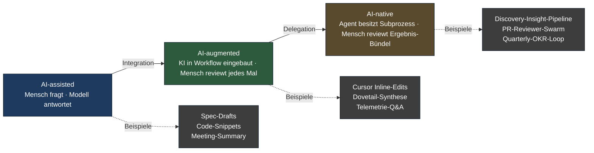
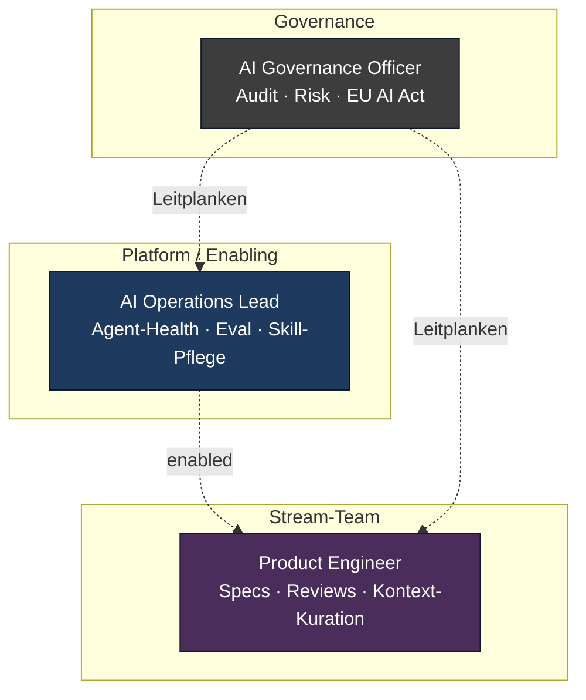

# AI-native Produktentwicklung: vom Beschleuniger zum Co-Operator

> Was nach AI-augmented kommt — und warum es kein Werkzeug-, sondern ein Rollen-Problem ist.

**Lesezeit: ~9 Min**

---

Mitte 2026 ist die Diskussion um KI in Produktteams nicht mehr "ob", sondern "wie tief".
Der Querschnitts-Layer aus [AI-augmented Workflows](../methods/modern/ai-augmented-workflows.md)
und der [AI-Tooling-Map](../visuals/ai-tooling-map.md) hat in reifen Organisationen
zwei Jahre lang Routine-Arbeit beschleunigt — Doku, Transkription, Boilerplate, Telemetrie-Sichtung.
Das war Phase eins. Was jetzt passiert, ist anders: Teams beginnen, **ganze Subprozesse** an
Agenten zu übergeben. Der Mensch bleibt verantwortlich, aber er führt nicht mehr jede Iteration.

Diese Sektion behandelt diesen Schritt. Sie heißt **AI-native**, weil die Architektur des
Produkt-Operating-Models neu gedacht werden muss, sobald Agenten als Mit-Akteure operieren,
nicht als Tools.

## Drei Reifegrade — und warum die Unterscheidung Geld wert ist

Wer "AI" in Produkt-Kontexten sagt, meint heute meist drei sehr unterschiedliche Dinge.
Sie zu verwechseln führt zu falschen Governance-Antworten und zu Budgets, die in
die falsche Stufe fließen.

| Stufe              | Eigentümerschaft                          | Kadenz                       | Risikoprofil                          |
|--------------------|-------------------------------------------|------------------------------|---------------------------------------|
| **AI-assisted**    | Mensch besitzt alle Schritte              | Ad hoc, on demand            | Niedrig — Mensch sieht jeden Output  |
| **AI-augmented**   | Mensch führt, KI assistiert in Tasks      | In Workflows integriert      | Mittel — KI in Pipelines, mit Review |
| **AI-native**      | Agent besitzt Sub-Prozess; Mensch reviewt | Kontinuierliche Auto-Loops   | Hoch — braucht Governance & Audit    |

Stufe eins ist Copy-Paste in ChatGPT. Stufe zwei ist der Coding-Agent im IDE, der
Transkriptions-Bot in Dovetail, der Outcome-Status-Draft aus Telemetrie. Stufe drei
ist neu: ein Discovery-Insight-Agent läuft 24/7 über alle Interview-Recordings einer
Woche und liefert montags ein OST-Update zur Review. Ein PR-Reviewer-Agent kommentiert
jeden neuen Pull-Request vor dem ersten menschlichen Auge. Ein OKR-Loop zieht monatlich
Telemetrie, vergleicht mit Hypothesen, postet eine Statusmeldung in Slack — Stakeholder
sehen sie, bevor jemand sie schreibt.

Die Verschiebung von Stufe zwei zu Stufe drei ist nicht "ein bisschen mehr KI".
Sie ist eine **Eigentümerschafts-Verlagerung**. Bei AI-augmented hält der Mensch
den Stift; bei AI-native gibt er den Stift weg und behält den roten.

## Rollen-Verschiebung: was sich in den Teams ändert

Aus zwei Jahren AI-augmented kennen wir drei entstehende Rollen
([siehe Blog-Post 5](../blog/05-ai-augmented-2026.md)). AI-native macht zwei davon
zur Pflicht und ergänzt eine dritte:

- **Product Engineer.** Verschmilzt die Grenze zwischen PM und Engineer in
  agent-zentrierten Workflows. Schreibt Spezifikationen, die Agents ausführen können,
  liest Diffs mit ähnlicher Routine wie Specs, kuratiert Kontext-Pakete. Auf der
  Stellenmatrix von Lenny's Newsletter 2026 die schnellst-wachsende Rolle.
- **AI Operations Lead.** Verantwortlich für Agent-Health: laufen die Loops? Wo
  driften Outputs? Welche Skills veralten? Diese Rolle ist nicht "Prompt-Ingenieur" —
  sie ist näher an SRE für agentische Systeme. Heute oft Teil eines
  Platform- oder Enabling-Teams im Sinne von Team Topologies.
- **AI Governance Officer.** Bei AI-augmented Empfehlung, bei AI-native nicht
  verhandelbar. Verantwortet Audit-Trails, Modell-Inventar, Risikoeinschätzung pro
  Use-Case und Konformität mit dem EU AI Act (vollständig anwendbar seit August 2026).

Was *nicht* entsteht — und das ist eine wichtige Nicht-Veränderung — ist eine
parallele "AI-PM"-Spur. KI bleibt Werkzeug; jeder PM muss sie führen können.
Wer eine eigene Rolle dafür schafft, externalisiert die Kompetenz und schwächt
das Team.

## Skill-Verschiebung: was Engineers und PMs jetzt können müssen

Die zentralen neuen Fertigkeiten sind nicht "KI-bedienen". Es sind
**vier konkrete Disziplinen**:

- **Prompt-Architektur.** Wiederverwendbare, getestete, versionierte Anweisungs-Strukturen
  schreiben — keine einmaligen Prompts. Die Anthropic-Engineering-Posts zu Skills und
  Subagents sind die aktuell beste Referenz.
- **Context-Engineering.** Was darf der Agent sehen, was nicht? Welche Files, welche
  Tools, welche Memory? Das ist näher an Compiler-Bau als an "Magie".
- **Evaluation.** Wie misst du, ob ein Agent besser geworden ist? Eval-Suites,
  Golden-Sets, Regression-Tests für Agents. Ohne Eval kein iterativer Fortschritt.
- **Risk-Reasoning.** Wo darf der Agent autonom handeln, wo nur vorschlagen, wo nie?
  Diese Einordnung pro Use-Case ist die schwerste und wichtigste Fertigkeit.

Wer diese vier Disziplinen im Team hat, kann AI-native sicher fahren. Wer sie nicht hat,
sollte bei AI-augmented bleiben — und ehrlich genug sein, das zu benennen.

## Wirtschaftlichkeit: Hebel-Vergrößerung, nicht Personalabbau

Ein klares Wort, weil die Frage in jedem Steering-Meeting unausgesprochen mitläuft:
**AI-native Produktentwicklung ist kein Sparprogramm.** Sie ist ein Hebel-Programm.

Wer empowerte Teams hat, die echte Outcomes verfolgen, kann mit Agent-Unterstützung
mehr Bets parallel laufen lassen, mehr Discovery-Tiefe leisten, schneller von
Hypothese zu Lernen kommen. Das vergrößert den *Wirkungs-Radius* pro Person. Es
verringert nicht den *Personalbedarf*. Cagans Kritik der vergangenen Jahre an
"AI als Cost-Cut-Story" trifft hier präzise: wer Stellen abbaut, weil Agents jetzt
Tasks übernehmen, hat das Operating-Model nicht verstanden. Tasks werden nicht
weniger — die wichtigen Tasks (Empowerment, Strategie, Beziehung, Architektur)
werden mehr. Die unwichtigen (Tippen, Verschieben, Statusmeldungen schreiben)
werden günstiger.

Eine konkrete Zahl als Anker: in Teams mit funktionierender AI-native-Praxis sehen
wir 2026 zwei bis vier *zusätzliche* Discovery-Stränge pro PM, nicht 30 % weniger
PMs. Wer das nicht glaubt, sollte den eigenen [Outcome-Loop](../cycle/enterprise-outcome-loop.md)
nochmal ehrlich anschauen: wo entstehen heute Engpässe? In den Köpfen oder in
den Tasks?

## Was bleibt — und worauf AI-native aufsetzt

Bei aller Verschiebung gilt: AI-native ist kein neues Operating-Model. Es ist
eine *Umsetzungs-Schicht* über dem bestehenden. Vier Dinge bleiben unverändert
zentral:

- **Outcome-Steuerung.** Mehr Output von Agents ist kein Erfolg; verschobene
  Outcomes sind es. Wer Agents auf Output-Metriken (Lines of Code, generierte Specs,
  geschriebene Doku) trimmt, baut eine schnellere Feature-Factory.
- **Discovery-Tiefe.** Echte Kundengespräche bleiben Pflicht — und werden in
  AI-native-Setups häufiger, nicht seltener. Agents übernehmen Aufbereitung, nicht
  Gespräche.
- **Empowerment.** Teams, die ihre Outcomes wirklich besitzen, nutzen Agents als
  Hebel. Teams, die nur Auftragsempfänger sind, nutzen sie als Beschäftigungs-Theater.
- **Langlebige Teams.** Wissen über Kunden, Code und Quirks akkumuliert in
  Menschen, nicht in Prompts oder Memory-Files. Fluktuation bleibt der teuerste
  Effizienzverlust.

Wer diese vier Fundamente nicht hat, sollte AI-native nicht ausrollen — er rollt
sonst nur Tempo in den falschen Loop.

## Was du in dieser Sektion findest

Die folgenden drei Dokumente vertiefen jeweils eine Dimension:

- [Methoden-Eignung](methods-suitability.md) — welche der 14 Methoden im Repo
  sich besonders für Agent-Ownership eignen, welche bewusst nicht, und nach welchen
  Achsen man das bewertet.
- [Claude Code Patterns](claude-code-patterns.md) — Skills, Subagents, Plugins,
  Hooks, Loops, MCP als Operating-System-Bausteine für Product-Teams, mit drei
  End-to-End-Workflow-Beispielen.
- [Orchestrierung](orchestration.md) — AI als Moderator: Async-Retros, Silent-Synthesis,
  Devil's-Advocate, Cross-Team-Outcome-Sync und die Grenzen davon.

Querverweise im gesamten Repo: [Outcome-Loop](../cycle/enterprise-outcome-loop.md),
[Vergleichsmatrix](../comparison/matrix.md),
[AI-augmented Workflows](../methods/modern/ai-augmented-workflows.md),
[AI-Tooling-Map](../visuals/ai-tooling-map.md),
[Blog-Post 5](../blog/05-ai-augmented-2026.md).

---

## Quellen

- Anthropic Engineering Blog (claude.com/engineering) — Skills, Subagents, Multi-Agent-Patterns
- Marty Cagan / SVPG (svpg.com) — "AI and the Product Operating Model" und Folge-Essays
- Lenny Rachitsky: *Lenny's Newsletter* — Rollen- und Stellenmarkt-Beobachtungen 2024–2026
- EU AI Act, Verordnung (EU) 2024/1689 — Anwendungsfristen Hochrisiko-Systeme
- Repo-Quelle: [AI-augmented Workflows](../methods/modern/ai-augmented-workflows.md)
- Repo-Quelle: [Enterprise Outcome-Loop](../cycle/enterprise-outcome-loop.md)
- Repo-Quelle: [Blog-Post 5 — AI 2026](../blog/05-ai-augmented-2026.md)
