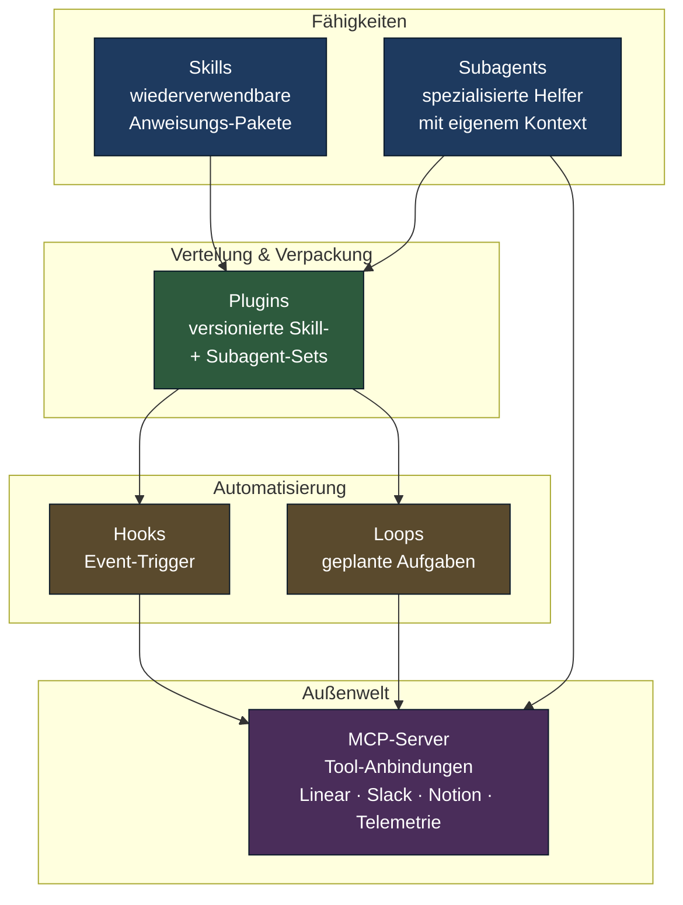
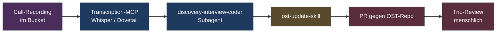
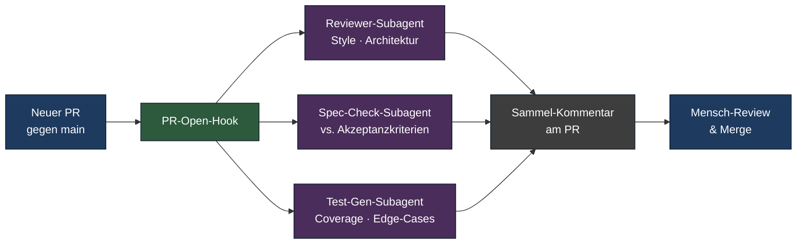
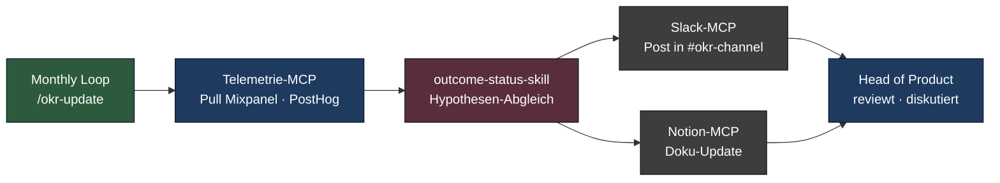

# Claude Code als Operating System für Product Automation

> Skills, Subagents, Plugins, Hooks, Loops, MCP — sechs Bausteine, mit denen sich Produkt-Subprozesse zuverlässig delegieren lassen.

**Lesezeit: ~14 Min**

---

Claude Code ist Anthropics CLI- und Agent-Umgebung für Coding und Workflow-Automatisierung
— eine Konsole, in der Modell, Datei-System, Versionierung, Tools und Hooks
zusammenlaufen. Für Produkt-Leser, die nie ein Terminal öffnen, ist sie das, was
Notion oder Linear für eure Workflows sind: eine Plattform, auf der Routinen
laufen — nur dass diese Routinen Modelle einbinden und über MCP an die anderen
Tools andocken können.

Die folgenden sechs Mechanismen sind die Bausteine, mit denen sich AI-native-Patterns
in der Praxis bauen lassen. Sie sind **modell-agnostisch** — vergleichbare Konzepte
gibt es in Cursor, Cody, Devin oder Codex. Die Beispiele hier sind mit Claude Code,
weil das Ökosystem 2026 am offensten und am besten dokumentiert ist.

## Architektur-Übersicht

Bevor wir in die einzelnen Bausteine gehen, lohnt der Blick auf das Ganze. Die
sechs Mechanismen formen ein Schichten-Modell — von der einzelnen Fähigkeit bis
zum geplanten Dauerlauf:

Die Trennung ist absichtlich: Skills und Subagents sind *Fähigkeiten*. Plugins
sind *Verteilung*. Hooks und Loops sind *Auslöser*. MCP ist *Andockung an die
Welt*. Jeder Mechanismus für sich ist überschaubar — die Kombinationen sind, wo
AI-native real wird.

## Skill — die wiederverwendbare Fertigkeit

Ein Skill ist ein Markdown-File mit Frontmatter — Name, Beschreibung, Trigger,
Anweisungen. Claude lädt einen Skill, wenn die Beschreibung zur aktuellen
Aufgabe passt. Skills sind das Äquivalent zu einer gut dokumentierten internen
Vorlage: sie kapseln eine wiederkehrende Anweisung mit Best-Practice-Beispielen.

**Produkt-relevante Skills, die heute schon gebaut werden:**

- **`okr-drafter`** — aus rohem Quartals-Outcome-Material plus Strategie-Kontext
  einen OKR-Entwurf nach Wodtke-Format generieren, inkl. Input-Metriken und
  Lead/Lag-Trennung.
- **`discovery-interview-coder`** — Transkripte gegen ein team-spezifisches Code-Buch
  taggen, Themen-Cluster mit Quote-Belegen, Vorschläge für OST-Updates.
- **`story-slicer`** — aus einem OST-Knoten plus Akzeptanzkriterien Splits nach
  Vertical-Slice-Prinzipien generieren, mit INVEST-Self-Check.
- **`retro-synthesizer`** — aus async-eingereichten Retro-Notizen (Notion oder
  Markdown) Cluster, Top-3-Spannungen und Action-Item-Drafts.

Ein Skill ist kein Prompt — es ist eine *versionierte, getestete, in das Repo
eingecheckte* Anweisung. Das ist der Unterschied zwischen "ich frage Claude"
und "unser Team hat eine Routine".

## Subagent — der spezialisierte Helfer

Ein Subagent hat eigenen Kontext, eigene Tools und einen begrenzten Auftrag.
Er läuft als Sub-Prozess innerhalb einer größeren Aufgabe und liefert ein
*Teil-Ergebnis* an den Haupt-Agent zurück. Das entspricht Anthropics
Multi-Agent-Pattern (Lead-Agent koordiniert spezialisierte Worker).

**Subagent-Profile, die in Produkt-Setups Wirkung zeigen:**

- **Research-Agent** — vertieft eine Wettbewerbs- oder Markt-Frage über Web-Such-Tools
  und Notion-Korpus, gibt zitierte Synthese zurück.
- **Reviewer-Agent** — liest einen Pull-Request, prüft gegen Code-Style, Architektur-Constraints,
  Test-Abdeckung. Kommentiert *vor* dem ersten menschlichen Review.
- **Synthesis-Agent** — clustert Inputs aus mehreren Quellen (Interview-Notizen,
  Slack-Threads, Telemetrie-Snapshots) und liefert Gemeinsamkeiten und
  Diskrepanzen.
- **Doc-Updater** — schaut sich einen gerade gemergten PR an und schlägt
  Doku-Änderungen vor (ADR-Update, README, Onboarding-Notiz).

Subagents sind teurer als Skills, weil sie eigenen Kontext-Aufbau brauchen. Sie
lohnen sich, wenn die Teil-Aufgabe **isolierbar** ist und der Haupt-Agent von
der Trennung profitiert (kleinerer Kontext, fokussiertere Tool-Auswahl).

## Plugin — geteilte, versionierte Skill-Sets

Plugins bündeln Skills, Subagents und Konfiguration zu einer installierbaren
Einheit. Eine Organisation kann so ihren eigenen "Product-OS"-Plugin pflegen
— alle Stream-Teams ziehen die gleiche Version, alle Updates werden zentral
ausgerollt.

**Beispiel: internes `product-os`-Plugin**

Enthält etwa:

- die oben genannten Skills (`okr-drafter`, `story-slicer`, …)
- einen `discovery-trio`-Subagent für Coding-Aufgaben
- Hook-Definitionen für PostCommit-Doku-Update
- MCP-Server-Konfiguration für Linear, Notion, Slack

Verteilt wird der Plugin über ein internes Repo (Marketplace-Mechanismus von
Claude Code unterstützt das). Versionierung folgt Semantic Versioning. Jedes
Team läuft eine bestimmte Version, Upgrades sind explizit. Das ist näher an
einer internen npm-Bibliothek als an einer KI-Konfiguration.

**Warum das wichtig ist:** ohne Plugin-Layer driften Teams in eigene Prompt-Sammlungen
ab. Mit Plugin-Layer existiert ein gemeinsamer Standard. Das ist im Sinne von
[Team Topologies](../methods/modern/team-topologies.md) ein *X-as-a-Service*-Angebot
eines Platform-Teams oder eines Enabling-Teams an die Stream-Teams.

## Hooks — Auto-Trigger bei Events

Hooks reagieren auf Ereignisse: Datei-Änderung, Commit, Merge, PR-Event, Build-Status.
Ein Hook ruft einen Skill oder Subagent auf, ohne dass jemand "Go" sagt.

**Produkt-relevante Hooks:**

- **PostCommit-Doku-Update.** Nach jedem Commit prüft ein Hook, ob die Doku
  noch synchron ist. Wenn nicht: PR-Vorschlag für die nötige Doku-Änderung,
  zur menschlichen Review.
- **PreCommit-Security-Scan.** Vor jedem Commit ein Subagent, der nach
  hartkodierten Secrets, PII-Mustern und problematischen Abhängigkeiten sucht.
  Block bei kritischen Findings, Hinweis bei Mittelschwere.
- **PostMerge-Outcome-Refresh.** Nach Merge eines PRs auf `main` schaut ein
  Hook, ob das Feature an einem Outcome-Knoten im OST hängt, und stößt einen
  Telemetrie-Pull an, um Baseline für die Outcome-Messung festzuhalten.

Hooks sind die ehrlichste Form von AI-native: sie laufen ohne menschlichen Anstoß.
Genau deshalb brauchen sie eine **Stopp-Regel**. Jeder Hook muss eine klare
Eskalation an einen Menschen haben, wenn der Agent außerhalb seiner Kompetenz
operiert. Wer das nicht definiert, baut sich eine Maschine, die selbstgenügsam
PRs öffnet, die niemand reviewt.

## Loops — geplante kontinuierliche Aufgaben

Loops sind zeitgesteuert: täglich, wöchentlich, monatlich. Sie sind das, was bei
GitHub Actions ein `cron`-Trigger ist — nur mit Modell-Zugriff.

**Produktiv eingesetzte Loops:**

- **`/loop 24h /check-pr-status`** — täglicher Statusbericht über offene PRs:
  wer wartet auf wen, welche stehen länger als zwei Tage, welche brauchen
  Konflikt-Auflösung. Postet zusammenfassend in einem Slack-Channel.
- **`/loop 1w /team-digest`** — wöchentliche Zusammenfassung pro Team:
  abgeschlossene Bets, offene Risiken, Discovery-Findings. Geht an Head of
  Product als Stakeholder-Update.
- **`/loop 1m /okr-update`** — monatlicher Outcome-Status-Draft mit
  Telemetrie-Daten, Hypothesen-Abgleich und Vorschlag zur Re-Kalibrierung des
  Outcomes.

Loops eignen sich für **Routine-Synthesen**, nicht für Entscheidungen. Sie
sparen den Tippteil; die Bewertung bleibt beim Menschen.

## MCP-Server — Tool-Anbindungen

Das **Model Context Protocol** (Anthropic-Standard, 2024 vorgestellt, 2025/26
breit angenommen) ist die Klebstoff-Schicht zwischen Modell und externer Welt.
Ein MCP-Server stellt Werkzeuge bereit — Lesen, Schreiben, Suchen, Auslösen
— gegen ein anderes System.

**Für Produkt-Workflows zentral:**

- **Linear / Jira MCP** — Issues lesen, Status setzen, Kommentare hinterlegen,
  Sprints abfragen.
- **Slack MCP** — Threads lesen, Channel posten, DMs (mit Vorsicht).
- **Notion MCP** — Pages lesen, OST und Spec-Docs aktualisieren, Backlinks.
- **Calendar MCP** — Meetings prüfen, Slots vorschlagen, Briefings vorbereiten.
- **Telemetrie-MCP** — Mixpanel, PostHog, Amplitude, Datadog. Read-only ist die
  sichere Default-Stufe.

Die Regel für MCP-Server-Auswahl ist: **lesen großzügig, schreiben restriktiv**.
Ein Agent darf viel sehen, aber wenig auslösen — und alles, was er auslöst, lässt
einen Audit-Trail. Das ist nicht Paranoia, das ist EU-AI-Act-konformes Engineering.

## Drei End-to-End-Workflows

Jetzt setzen wir die Bausteine zusammen. Die drei folgenden Workflows sind
Beispiele aus realer Praxis 2026 — nicht spekulativ, aber bewusst vereinfacht,
um die Architektur sichtbar zu lassen.

### Workflow 1: Discovery-Insight-Pipeline

Ein Trio führt pro Woche fünf Interviews. Statt Mittwochabend zwei Stunden
Aufbereitung sieht der Mittwoch so aus: alle Calls sind in Recording-Bucket,
ein Loop pickt sie auf, läuft durch die Pipeline und liefert Donnerstagfrüh
einen Pull-Request gegen den OST.

**Was hier wichtig ist:** der Agent endet bei "PR". Er mergt nicht selbst, er
ruft nicht den Kunden zurück. Die letzte Meile bleibt menschlich — und genau
das ist die Linie zwischen "Hebel" und "Halluzinations-Theater".

### Workflow 2: PR-Review-Orchestrator

Jeder neue Pull-Request gegen `main` löst einen Hook aus, der drei Subagents
parallel startet. Erst wenn alle drei Reports vorliegen, sieht der menschliche
Reviewer den PR.

Der Trick: die drei Subagents haben **disjunkten Kontext**. Der Reviewer-Agent
sieht den Code-Diff. Der Spec-Check-Agent sieht das Linear-Ticket. Der Test-Gen-Agent
sieht die Test-Files. Disjunkter Kontext = unterschiedliche Fehler-Profile =
besseres Sammel-Urteil. Das ist die produkt-orientierte Lesart des
Multi-Agent-Patterns aus dem Anthropic Engineering Blog.

### Workflow 3: Quarterly-OKR-Loop

Ein monatlich laufender Loop, der den Outcome-Status aktualisiert. Im Quartals-Review
landen so vorbereitete Daten, nicht zusammen-improvisierte Zahlen.

Was hier zählt: der Loop entscheidet nichts. Er liefert eine **vorgeschriebene
Diskussionsgrundlage**. Das Quartals-Review ist immer noch ein menschliches
Gespräch — nur jetzt mit Material, das nicht in der Nacht davor improvisiert
wurde.

## Was du davon mitnehmen solltest

Drei praktische Schlüsse, wenn du diese Patterns in deinem Team einführen willst:

1. **Klein anfangen, mit Hooks.** Ein einziger PostCommit-Doku-Hook ist ein
   guter erster Test. Niedriges Risiko, klarer Wert, sofort sichtbar.
2. **Plugin-Layer früh planen.** Sobald drei Teams ähnliche Skills nutzen,
   wird das interne Plugin zur Pflicht. Sonst driften die Routinen auseinander
   und du verlierst Konsistenz.
3. **Audit-Trail als Default.** Jeder Subagent, jeder Hook, jeder Loop schreibt
   ein Log: was wurde gelesen, was wurde geschrieben, welcher Mensch hat
   reviewt. Das ist nicht Bürokratie, das ist die Voraussetzung für Vertrauen
   in die Routinen — intern und gegenüber Regulatoren.

Patterns, die menschliche Moderation und Konsens-Findung in Meetings adressieren —
also "AI als Prozess-Moderator", nicht als Subprozess-Operator — sind im nächsten
Dokument: [Orchestrierung](orchestration.md).

---

## Quellen

- Anthropic Engineering Blog (claude.com/engineering) — Skills, Subagents,
  Multi-Agent-Research-Patterns, MCP-Server-Tutorials
- Model Context Protocol Spezifikation (modelcontextprotocol.io)
- Claude Code Dokumentation (docs.claude.com) — Hooks, Loops, Plugin-Verteilung
- Cursor, Cody, Devin, OpenAI Codex, Replit Agent — vergleichbare Patterns,
  unterschiedliche Reife
- Marty Cagan / SVPG — "AI-PM"-Skepsis und Skill-Verschiebung im Engineering
- Lenny Rachitsky: *Lenny's Newsletter* — Praxis-Berichte zu Agent-Workflows
- Repo-Quelle: [AI-augmented Workflows](../methods/modern/ai-augmented-workflows.md)
- Repo-Quelle: [AI-Tooling-Map](../visuals/ai-tooling-map.md)
- Repo-Quelle: [Methoden-Eignung](methods-suitability.md)
