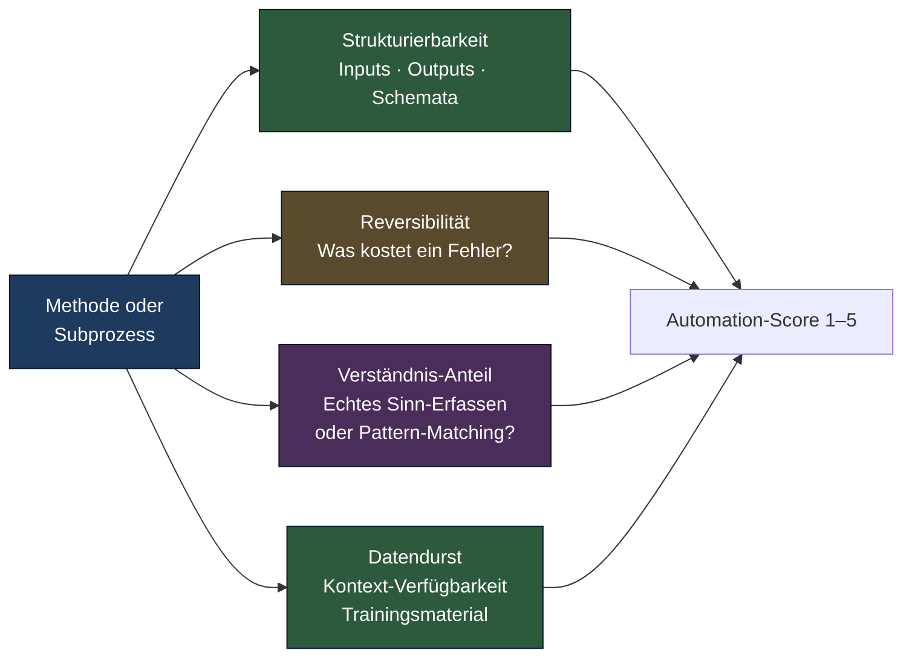
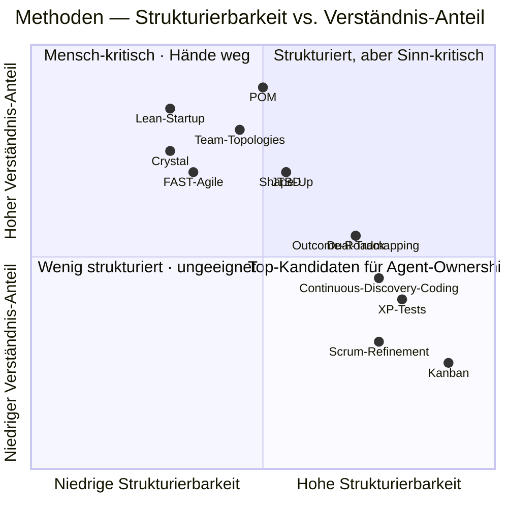

# Welche Methoden sich besonders für Automatisierung eignen

> Ein Bewertungs-Rahmen für Agent-Ownership — und eine ehrliche Liste der Bereiche, in denen Mensch-bleibt-Mensch.

**Lesezeit: ~11 Min**

---

Sobald Teams ernsthaft mit AI-native-Patterns experimentieren, taucht sehr früh
die falsche Frage auf: *"Welche Methode automatisieren wir als nächstes?"*. Die
richtige Frage ist feiner: **In welcher Methode lässt sich welcher Subprozess wie
weit an einen Agenten abgeben — und was kostet ein Fehler?**

Diese Seite liefert dafür einen Rahmen, eine Bewertung aller 14 Methoden aus der
[Vergleichsmatrix](../comparison/matrix.md), und eine Top- und Bottom-Liste mit
konkreten Use-Cases.

## Bewertungs-Rahmen: vier Achsen

Statt "geeignet/nicht geeignet" zwingen vier Achsen dich zu einem präziseren Urteil.
Jede Achse wird 1 (sehr niedrig) bis 5 (sehr hoch) bewertet; der **Automation-Score**
ist eine gewichtete Mischung — Strukturierbarkeit und Datendurst zählen positiv,
Verständnis-Anteil negativ, Reversibilität als Modulator.

**Was die Achsen konkret messen:**

- **Strukturierbarkeit:** Lassen sich Eingaben (Inputs) und gewünschte Ausgaben
  (Outputs) als Schemata, Listen, Felder beschreiben? Eine Kanban-Karte hat
  strukturierbare Felder; ein Empowerment-Gespräch nicht.
- **Reversibilität:** Wenn der Agent danebenliegt — wie teuer wird das? Ein
  fehlerhafter Refinement-Notiz-Draft kostet 5 Minuten Korrektur. Eine fehlerhafte
  Bet-Entscheidung kostet ein Quartal.
- **Verständnis-Anteil:** Reicht es, Muster aus existierenden Beispielen zu
  reproduzieren? Oder muss man wirklich verstehen, was Menschen *meinen*? OST-Coding
  funktioniert mit Pattern-Matching gut; Empowerment-Coaching nicht.
- **Datendurst:** Gibt es genug Kontext, um den Agent zu speisen — historische Daten,
  Beispiele, Templates, Vorgänger-Entscheidungen? Telemetrie ist datenreich, frische
  Strategie-Bets sind datenarm.

## Alle 14 Methoden — Automation-Score

| Methode                       | Struktur | Reversib. | Verst. | Daten | Score | Kurz-Begründung                                                        |
|-------------------------------|---------:|----------:|-------:|------:|------:|------------------------------------------------------------------------|
| Kanban                        |        5 |         4 |      2 |     5 | **5** | Hoch strukturiert; Drift-Detection und Reminder sind Standardfälle     |
| Scrum (Refinement, Reports)   |        4 |         4 |      2 |     4 | **4** | Stories slicen, Velocity-Reports, Refinement-Vorbereitung              |
| XP (Test-Generation)          |        4 |         4 |      3 |     5 | **4** | TDD-Loop ist strukturierbar; Tests aus Specs gut machbar               |
| Crystal                       |        2 |         3 |      4 |     2 | **2** | Sehr menschen-zentriert, kaum Schemata                                 |
| Shape Up                      |        3 |         2 |      4 |     2 | **2** | Pitches brauchen Verständnis; Hill-Charts mechanisch                   |
| Dual-Track Agile              |        4 |         3 |      3 |     4 | **3** | Delivery-Track gut; Discovery-Track teilweise                          |
| Continuous Discovery (Coding) |        4 |         4 |      3 |     5 | **4** | Interview-Coding, Theme-Extraktion, OST-Update-Drafts                  |
| Lean Startup                  |        2 |         1 |      5 |     2 | **1** | Bets sind irreversibel; Pivot-Entscheidung verlangt Sinn-Erfassen      |
| Jobs-to-be-Done               |        3 |         2 |      4 |     3 | **2** | Job-Stories aus Transkripten ja; Job-Identifikation nein               |
| Team Topologies               |        3 |         2 |      4 |     3 | **2** | Team-Schnitt ist Org-Therapie, kein Algorithmus                        |
| FAST Agile                    |        2 |         3 |      4 |     2 | **2** | Self-Organisation lebt von menschlicher Aushandlung                    |
| Outcome-based Roadmapping     |        4 |         3 |      3 |     4 | **3** | Outcome-Status-Drafts gut; Outcome-Definition braucht Strategie        |
| Product Operating Model       |        3 |         2 |      5 |     3 | **2** | Empowerment, Vertrauen, Topologie — nicht delegierbar                  |
| AI-augmented Workflows        |        — |         — |      — |     — |   **—** | Ist selbst der Layer; nicht Gegenstand der Bewertung                   |

Die Skala ist bewusst grob — sie soll Priorisierungs-Gespräche im Team
strukturieren, keine Kapazitäts-Planung erzeugen.

## Quadranten-Sicht: was lohnt sich wirklich?

Die zwei Achsen mit dem größten Erklärwert sind **Strukturierbarkeit** und
**Verständnis-Anteil**. Auf einem invertierten Diagramm (hohe Strukturierbarkeit,
niedriger Verständnis-Anteil = idealer Automatisierungs-Kandidat) verteilen sich
die Methoden so:

**Lesart:**

- **Quadrant 4 (unten rechts):** Top-Kandidaten — Kanban-Flow, Scrum-Refinement,
  XP-Test-Generation, Continuous-Discovery-Coding. Hier kann Agent-Ownership
  schnell laufen, mit niedrigem Risiko.
- **Quadrant 1 (oben rechts):** Strukturiert, aber Sinn-kritisch. Dual-Track,
  Outcome-Roadmapping, JTBD, Shape Up. Agents können hier *vorbereiten*,
  nicht entscheiden.
- **Quadrant 2 (oben links):** Mensch-kritisch — POM, Lean Startup, Team Topologies,
  Crystal, FAST. Hier ist Automatisierung das falsche Ziel. Wer es trotzdem
  versucht, demoliert die Methode.
- **Quadrant 3 (unten links):** Kommt in dieser Bewertung nicht prominent vor —
  Methoden mit niedriger Strukturierbarkeit *und* niedrigem Verständnis-Anteil
  sind selten und meist unausgereift.

## Top-5 für Agent-Ownership — mit konkreten Use-Cases

Diese fünf sind die naheliegendsten Einstiege. Sie sind alle reversibel, datenreich,
gut strukturiert.

### 1. Kanban Flow-Monitoring

Ein Agent beobachtet das Board kontinuierlich und meldet:

- **WIP-Drift:** Spalte über Limit, seit wie lange, welcher Task hängt?
- **Throughput-Anomalie:** wöchentlicher Durchsatz weicht > 1 σ vom Schnitt ab.
- **Replenishment-Reminder:** Backlog-Queue unter Schwelle, neue Items pullen.
- **Aging-Cards:** Karten älter als die typische Cycle-Time werden eskaliert.

Mensch entscheidet, was zu tun ist — der Agent erkennt, wann zu reagieren ist.

### 2. Continuous Discovery — Interview-Coding und OST-Drafts

Ein Pipeline-Agent verarbeitet Interview-Aufnahmen:

- Transkription über MCP-Tool (Whisper-basiert oder Vendor wie Dovetail)
- Theme-Coding nach Trio-spezifischem Code-Buch
- Insight-Linking zu existierenden OST-Knoten
- Vorschlag für neue Sub-Opportunities (zur Review im Trio)

Cagans Kritik gilt: **echte Interviews bleiben Mensch-zu-Mensch**. Der Agent macht
Aufbereitung und Synthese, niemals das Gespräch.

### 3. Story-Slicing und Refinement-Vorbereitung

Aus einem OST-Knoten plus Akzeptanzkriterien generiert ein Skill-basiertes Agent
einen Refinement-Entwurf: Splits, Risiken, offene Fragen, INVEST-Check, Test-Ideen.
Das Team kommt zur Refinement mit einer Diskussionsgrundlage statt einer leeren
Tafel. Zeitersparnis im Mittel: 40–60 % pro Session, in unseren Beobachtungen 2026.

### 4. Test-Generation aus Specs

Wenn die Spec (Akzeptanzkriterien, Schnittstellen, Business-Rules) sauber ist,
ist die Generierung von Unit-Tests, Property-based Tests und Integrations-Skeletten
für einen Agent gut machbar. Engineering-Review bleibt Pflicht. **Vibe-Coding-Anti-Pattern**
([siehe Blog 5](../blog/05-ai-augmented-2026.md)) entsteht hier nicht durch die
Tests selbst, sondern durch ihre kritiklose Akzeptanz.

### 5. Telemetrie-Analyse — Outcome-Status-Drafts

Monatlich oder quartalsweise zieht ein Loop-Agent Metriken aus Telemetrie-Stores
(Mixpanel, PostHog, Amplitude, Datadog), gleicht sie mit Outcome-Hypothesen ab und
schreibt einen Status-Draft: was wirkt, was wirkt nicht, welche Hypothesen sind zu
revidieren. Das Trio entscheidet — bekommt aber eine vorgeschriebene Grundlage.

## Bottom-5 — bewusst nicht automatisieren

Genauso wichtig wie die Top-Liste ist die ehrliche Bottom-Liste. Diese fünf Bereiche
sind 2026 *nicht* sinnvoll an Agents abzugeben — nicht aus Technologie-Grenzen,
sondern aus Methoden-Logik.

### 1. Echte Kundeninterviews

Beziehung, nonverbale Signale, Vertrauen, Hör-Pausen, Folgefragen aus Bauchgefühl —
all das ist konstitutiv für Discovery-Tiefe. Ein Agent kann transkribieren,
analysieren, synthetisieren. Er kann nicht zuhören, nicht ein Gespräch tragen,
nicht den Kunden ernst nehmen. Wer das delegiert, hat aufgehört, Produkt zu
entwickeln, und angefangen, Daten zu sammeln.

### 2. Empowerment-Coaching

Empowerment ist eine zwischenmenschliche, longitudinale Beziehung. Sie braucht
Vertrauen, Vorbild, Wiederholung über Monate. Cagans
[POM-Profil](../methods/modern/product-operating-model.md) macht das explizit. Kein
Coach-Bot ersetzt einen Head of Product, der mit einem PM über sechs Monate echte
Verantwortungs-Verschiebung übt.

### 3. Kritische Strategie-Bets

Die obere rechte Ecke der Risikomatrix in der [AI-Tooling-Map](../visuals/ai-tooling-map.md).
Bets sind per Definition irreversibel auf Quartals- oder Jahres-Horizont. Ein
halluzinierender Agent kostet hier eine BU. Synthese ja, Entscheidung nein.

### 4. Konflikt-Mediation

Spannungen zwischen Teams, Personen, BUs. Politische Texturen. Hierarchie-Verschiebungen.
Hier reicht Pattern-Matching nicht — und ein neutral klingender Agent verstärkt
oft den Konflikt, weil er Beziehungs-Tiefe vortäuscht, die nicht da ist.

### 5. Vertrauensaufbau in neuen Teams

Ein Team, das gerade zusammenkommt, baut Vertrauen über geteilte Verletzlichkeit,
gemeinsame frühe Erfolge, ehrliche Konflikte. Agents als Moderatoren in dieser
Phase fühlen sich für die Beteiligten *kalt* an — und Kälte ist im Vertrauensaufbau
kontra-produktiv. (Mehr dazu in [Orchestrierung](orchestration.md).)

## Praktische Auswahl: wo anfangen?

Wenn dein Team mit AI-native experimentieren will, folge der Reihenfolge des
[Outcome-Loops](../cycle/enterprise-outcome-loop.md) von Querschnitt nach innen:

1. **Querschnitt** — Kanban-Monitoring, Refinement-Vorbereitung, Doku-Loops.
2. **Operate** — Telemetrie-Analyse, Incident-Drafts.
3. **Delivery** — Test-Generation, PR-Review-Subagents.
4. **Discovery** — Interview-Coding, OST-Drafts. *Nicht* die Gespräche selbst.
5. **Strategie** — bewusst spät; Synthese ja, Entscheidung nein.

Das ist dieselbe Reihenfolge wie bei AI-augmented — nur jetzt mit echter
Delegation statt Assistenz. Tooling und Patterns dafür: siehe
[Claude Code Patterns](claude-code-patterns.md).

---

## Quellen

- Anthropic Engineering Blog (claude.com/engineering) — Skills, Subagents, Eval-Praxis
- Teresa Torres: *Continuous Discovery Habits* — Trio-Verantwortung im Discovery-Coding
- Marty Cagan / SVPG — Kritik an synthetischen Nutzern und delegiertem Empowerment
- Lenny Rachitsky: *Lenny's Newsletter* — laufende Praxis-Berichte zu Agent-Adoption
- Repo-Quelle: [Vergleichsmatrix](../comparison/matrix.md)
- Repo-Quelle: [AI-Tooling-Map](../visuals/ai-tooling-map.md)
- Repo-Quelle: [AI-augmented Workflows](../methods/modern/ai-augmented-workflows.md)
