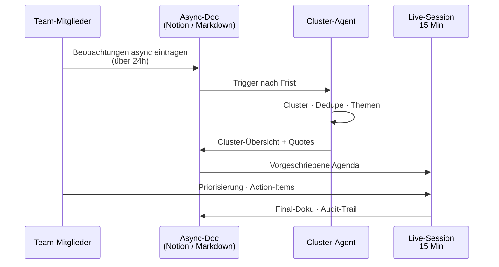
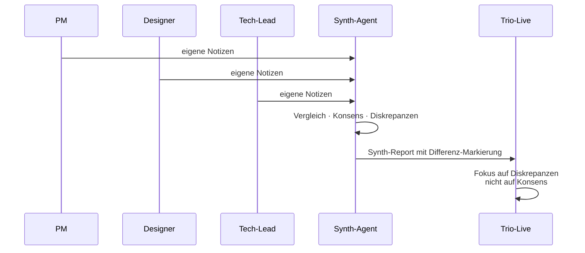
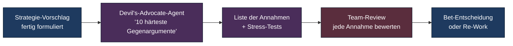
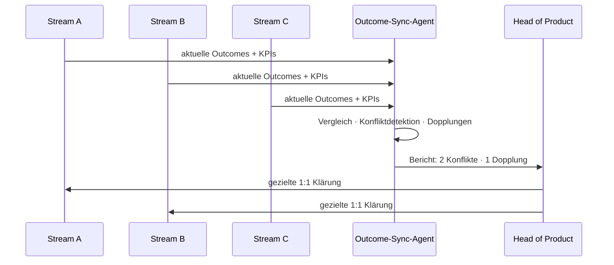
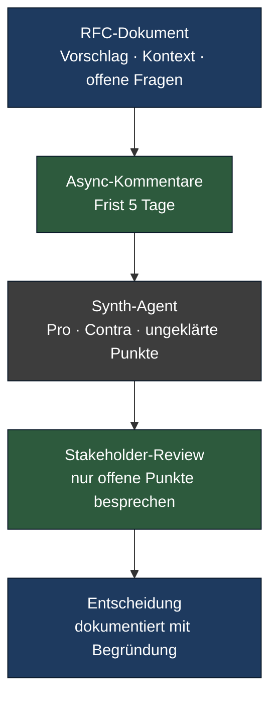

# AI als Prozess-Moderator: wenn die Maschine das Meeting führt

> Async-Retros, Silent-Synthesis, Devil's-Advocate-Bots — wo AI als Moderator echte Org-Probleme löst, und wo sie scheitert.

**Lesezeit: ~10 Min**

---

In den vorigen Dokumenten dieser Sektion ging es um Subprozesse, die ein Agent
*besitzt* — Pipelines, PR-Reviews, Outcome-Loops. Es gibt eine zweite, leiser
diskutierte Anwendung von AI-native: **AI als Moderator** von Meetings, Reviews,
Entscheidungs-Prozessen. Die Maschine führt das Gespräch — und der Mensch
spricht.

Das klingt zunächst dystopisch ("eine KI moderiert meine Retro?"). In der Praxis
löst es ein anderes, sehr reales Problem: **Org-Pathologien, die menschliche
Moderatoren strukturell schlecht adressieren**. Stimm-Asymmetrie, Konsens-Drift,
vergessene Action-Items, kulturelle Hierarchien, die das offene Wort dämpfen.
Ein neutral wirkender Moderator-Agent kann hier präziser arbeiten als ein
gestresster PM oder ein Scrum Master mit Eigeninteresse.

Diese Seite zeigt vier Use Cases, drei wiederverwendbare Patterns, eine ehrliche
Grenze und die Governance-Anforderungen.

## Vier Use Cases — wo AI als Moderator funktioniert

### 1. Async-Retro-Moderation

Klassische Retros leiden an zwei Krankheiten: die Stimm-stärksten dominieren,
und die spannendsten Themen kommen erst beim Bier nach Feierabend auf. Eine
Async-Variante adressiert beides: jeder schreibt vorab seine Beobachtungen in
ein gemeinsames Dokument, AI clustert über Nacht, das Team trifft sich am
nächsten Tag für 15 Minuten Priorisierung.

Was sich konkret ändert: Die introvertierte Hälfte des Teams hat Zeit, präzise
zu schreiben. Die extrovertierte Hälfte verliert ihr Lautstärke-Privileg. Der
Cluster-Agent macht Synthese ohne politische Schlagseite. Die Live-Session
diskutiert die schwersten drei Cluster, nicht die zwölf, die jemand spontan
aufschreibt.

### 2. Silent-Synthesis im Discovery-Trio

Trio-Synthese nach Interviews ist ein Klassiker — und ein Klassiker des
Confirmation-Bias. Wer als erstes spricht, ankert das Trio. Silent-Synthesis
dreht das um: alle drei notieren *unabhängig*, ein Agent synthetisiert, das
Trio bespricht *Differenzen*.

Der Effekt ist subtil und wichtig: die Trio-Diskussion verschiebt sich von
"wo stimmen wir überein" (Bestätigung) zu "wo sehen wir verschieden" (Lernen).
Das ist im Sinne von Torres' Continuous Discovery präzise das, wo Discovery-Tiefe
entsteht.

### 3. Devil's-Advocate-AI vor Strategie-Commitment

Strategie-Entscheidungen in Gruppen leiden an Konsens-Drift: niemand will der
Spielverderber sein, alle nicken sich nach drei Stunden in eine Bet, die in
Wahrheit zwei Personen schon problematisch fanden. Ein Devil's-Advocate-Agent
hat diese soziale Hemmung nicht.

Der Agent wird gezielt **adversarial geprimt**: "Finde die zehn härtesten
Argumente *gegen* diese Strategie. Welche Annahmen sind unbelegt? Welche
Markt-Signale widersprechen? Welche internen Pfade führen ins Leere?". Das
ist Hypothese-stärken-durch-Angriff, nicht Halluzination-feiern. Das Team
beantwortet die Liste — jede Annahme wird benannt, geprüft, verworfen oder
gehärtet.

### 4. Cross-Team-Outcome-Sync

In Organisationen mit mehreren Streams gibt es zwei Dauerprobleme: Doppelarbeit
(zwei Teams bauen dieselbe Lösung) und Konflikte (zwei Outcomes ziehen das
gleiche Metrik-Ziel in unterschiedliche Richtungen). Ein wöchentlicher
Sync-Agent vergleicht die Outcomes aller Streams und markiert Reibungen.

Das ersetzt **kein** Steering-Meeting — es macht das Steering-Meeting kürzer
und gezielter. Statt jedes Team berichtet seine Outcomes erschöpfend, beginnt
das Meeting mit den drei Reibungspunkten, die der Sync-Agent gefunden hat.

## Drei wiederverwendbare Patterns

Über die vier Use Cases hinaus kristallisieren sich drei Patterns heraus, die du
in vielen Kontexten anwenden kannst.

### Pattern A: Silent-Synthesis

Mehrere Stimmen → unabhängige schriftliche Beiträge → Agent synthetisiert →
Fokus auf Differenzen. Anwendbar für jede Sitzung, in der Gruppendynamik
das Ergebnis verzerrt: Retros, Trio-Synthese, Architektur-Reviews, Hiring-Debriefs.

### Pattern B: RFC-with-AI-Moderator

Asynchrone Entscheidungs-Findung über ein Request-for-Comments-Dokument. Statt
einer Stunde Meeting: schriftlicher Vorschlag, Kommentar-Phase mit Frist,
Agent fasst Pro/Contra zusammen, markiert Punkte, die noch nicht beantwortet
sind. Entscheider sieht eine vorverdichtete Diskussion, nicht eine 60-Kommentar-Schlacht.

### Pattern C: Long-Term-Memory

Das wahrscheinlich unterschätzteste Pattern: ein Agent, der das **Org-Gedächtnis**
hält — vergangene Entscheidungen, ihre Begründungen, die damaligen Annahmen,
spätere Outcomes. Bei jeder neuen Diskussion kann jeder fragen: *"Haben wir das
schonmal entschieden? Wenn ja, warum, und was kam dabei raus?"*. Das adressiert
eine teure Org-Pathologie: dieselbe Frage alle 18 Monate neu zu debattieren,
weil niemand mehr weiß, warum sie damals so beantwortet wurde.

Implementiert als Subagent über ein gepflegtes Entscheidungs-Repository (ADRs,
Bet-Logs, Retros). MCP-Anbindung an Notion oder Confluence. Niedrige
Halluzinations-Wahrscheinlichkeit (alles ist im Korpus), hoher Wert pro
beantworteter Frage.

## Wo AI als Moderator scheitert

Die Versuchung ist groß, "Moderation" auf alle Gesprächsformate auszuweiten.
Vier Bereiche sind 2026 hart abgegrenzt — hier scheitert AI-Moderation
verlässlich und produziert oft mehr Schaden als Nutzen.

- **Emotionale Konflikte.** Wenn zwei Team-Mitglieder echte zwischenmenschliche
  Spannung haben, braucht es einen Menschen, der zuhört. Ein Agent, der
  "neutralisiert", entwertet die Beteiligten.
- **Politische Spannungen.** Macht-Verschiebungen, Budget-Verteilung, BU-Konflikte.
  Hier ist Neutralität eine Lüge — jede Entscheidung hat Gewinner und Verlierer.
  Ein Agent, der das nicht offenlegt, verstärkt Misstrauen.
- **Vertrauensaufbau in neuen Teams.** Vertrauen wächst durch geteilte
  Verletzlichkeit, durch echte Erfolge, durch ehrliche Konflikte. Ein
  Agent als "Erleichterer" in dieser Phase wird als Distanz wahrgenommen.
- **Performance-Gespräche.** Feedback an einzelne Personen, vor allem
  schwieriges. Niemals durch einen Agent. Das ist eine Führungsaufgabe und
  bleibt es.

Diese vier Bereiche entsprechen der Bottom-Liste aus
[Methoden-Eignung](methods-suitability.md) — und das ist kein Zufall. Wo
Beziehung das Medium ist, ist AI das falsche Werkzeug.

## Governance: was du nicht aufschieben kannst

AI als Moderator hat eine eigene Governance-Liste, die strenger ist als bei
Subprozess-Agenten. Die folgenden fünf Punkte sind 2026 nicht verhandelbar:

- **Audit-Trail.** Was hat der Agent moderiert, was synthetisiert, was
  vorgeschlagen? Ein vollständiger Log pro Sitzung, mindestens 12 Monate
  aufbewahrt, einsehbar für Beteiligte und Compliance. Ohne das ist später
  unklar, ob eine Entscheidung "die Gruppe" oder "der Agent" getroffen hat.
- **Transparenz.** Alle Teilnehmer wissen, dass ein Agent moderiert. Ein
  Slack-Bot, der Beiträge clustert, ohne dass das Team es weiß, ist eine
  Vertrauensbruch-Maschine. Das gilt für jede Form der Moderation.
- **Opt-Out.** Jede einzelne Person muss aus der Agent-Moderation aussteigen
  können, ohne Begründung. Wer das nicht garantiert, kommt mit DSGVO und
  EU AI Act schnell in Konflikt — und wichtiger: er verliert Beteiligungs-Qualität.
- **Bias-Reviews.** Regelmäßig (mindestens quartalsweise) prüft das Team, ob
  der Cluster-Agent systematisch bestimmte Stimmen unterrepräsentiert.
  Synthese-Modelle haben subtile Sprach-Biases — Engineer-Speak wird oft
  präziser geclustert als Design-Vokabular. Wer das nicht prüft, verstärkt
  unbewusst kulturelle Hierarchien.
- **EU-AI-Act-Einordnung.** Moderations-Agenten in HR-Kontexten (Retros, die
  in Performance-Bewertungen einfließen, Hiring-Debriefs) können in
  Hochrisiko-Kategorien des EU AI Act fallen. Anhang III, Punkt 4
  ("Beschäftigung, Personalmanagement"). Konformitätsbewertung, Risk-Management-System
  und CE-Kennzeichnung sind seit August 2026 vollständig anwendbar. Eine
  Einordnung pro Use-Case ist Pflicht-Übung des AI Governance Officers.

## Zusammenfassung

AI-Moderation ist 2026 keine Spielerei mehr. Sie löst echte Probleme
empowerter Produktorganisationen — Stimm-Asymmetrie, Konsens-Drift,
Org-Gedächtnis-Verlust. Sie löst sie *unter Bedingungen*: Transparenz,
Audit-Trail, Opt-Out, klare Abgrenzung gegen Beziehungs-Themen.

Die produkt-orientierte Lesart: AI-Moderatoren sind ein **Enabling-Layer
für Empowered Teams**, nicht ein Ersatz für Führung. Sie geben Stimmen Raum,
die sonst untergehen — und sie geben Diskussionen Struktur, die sonst zerfasern.
Sie ersetzen nicht den schweren Teil: Vertrauen, Konflikt, Sinn.

Wer den Sprung von [AI-augmented](../methods/modern/ai-augmented-workflows.md)
zu AI-native ernsthaft geht — mit [Claude-Code-Patterns](claude-code-patterns.md)
für Subprozesse und Moderations-Agents für Meetings — verändert nicht
die Produkte. Er verändert, wie das Team über Produkte denkt. Und das ist,
am Ende, der einzige Hebel, der dauerhaft wirkt.

---

## Quellen

- Anthropic Engineering Blog (claude.com/engineering) — Multi-Agent-Patterns,
  Tool-Use, Safety-Themen
- Teresa Torres: *Continuous Discovery Habits* — Trio-Dynamik, Confirmation-Bias-Vermeidung
- Christina Wodtke: *Radical Focus* — Entscheidungs-Doku als Org-Disziplin
- EU AI Act, Verordnung (EU) 2024/1689, Anhang III — Hochrisiko-Kategorien
  Beschäftigung und Personalmanagement
- Lenny Rachitsky: *Lenny's Newsletter* — Async-Praktiken in verteilten Teams
- Repo-Quelle: [Methoden-Eignung](methods-suitability.md)
- Repo-Quelle: [Claude Code Patterns](claude-code-patterns.md)
- Repo-Quelle: [Überblick AI-native](00-overview.md)
