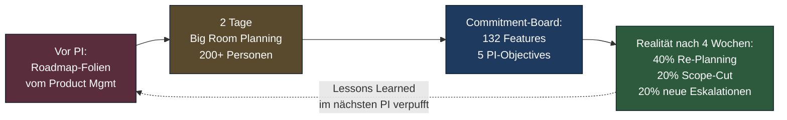
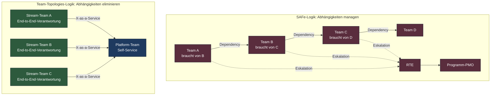
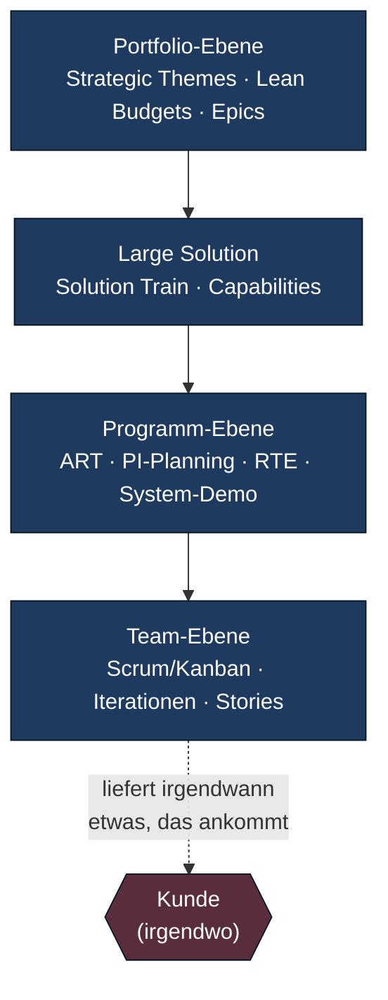

# Warum SAFe und LeSS nicht die Antwort sind

*Eine Bestandsaufnahme der Skalierungs-Frameworks — und warum sie das Problem
lösen, das du gar nicht hast.*

Lesezeit: ~10 Min · Serie: [Übersicht](index.md) · Teil 1 von 5

---

## Du kennst diesen Moment

Tag zwei des PI-Plannings. Die Sporthalle ist gemietet, das Catering steht,
am Whiteboard hängt eine Wand aus Post-its in fünf Farben. Ein RTE tippt
gerade die zweite Risiko-Liste in Jira ein. Zwei Tech-Leads diskutieren
seit zwanzig Minuten, ob ein Feature die PI-Boundary überschreitet oder
nicht. Der Product Manager neben dir flüstert: *"Wir wissen doch beide,
dass der Plan in vier Wochen Makulatur ist."*

Du nickst. Alle nicken. Und am Freitag stehen 132 Commitments im Board,
die nach Sprint 2 niemand mehr nachhält.

Genau dieser Moment ist der Grund, warum diese Serie existiert. Nicht weil
SAFe böse wäre. Nicht weil LeSS naiv wäre. Sondern weil beide Frameworks
ein Versprechen einlösen, das du gar nicht brauchst — und das verfehlen,
das du tatsächlich brauchst.

## Was Skalierungs-Frameworks versprechen

Wenn du dir die Marketing-Bilder von SAFe und LeSS anschaust, hörst du
drei Versprechen:

1. **Predictability** — wir wissen in 12 Wochen, was geliefert wird.
2. **Alignment** — 200, 500, 2000 Menschen ziehen in dieselbe Richtung.
3. **Scaled Agile** — Agilität funktioniert auch jenseits eines Teams.

Diese Versprechen klingen vernünftig. Sie klingen sogar nach genau dem,
was ein CTO oder eine CIO bei einem 800-Personen-Engineering-Apparat
braucht. Genau deshalb verkauft sich SAFe seit Jahren so gut, und genau
deshalb folgen Konzernvorstände den Beratungs-Decks, ohne nachzufragen.

Das Problem: Diese Versprechen sind eine Antwort auf die falsche Frage.

## Was sie tatsächlich optimieren

Schau dir an, was ein Skalierungs-Framework im Alltag tut, nicht was es
sagt. Ein SAFe-Release-Train optimiert drei Dinge:

- **Synchronisation** zwischen Teams, die voneinander abhängen.
- **Sichtbarkeit von Abhängigkeiten** in einem Programm-Backlog.
- **Vorhersagbarkeit** durch fixe Kadenzen (PI, Sprint, Iteration).

Das ist Logistik. Es ist gute Logistik, wenn dein Problem Logistik wäre.
Aber dein Problem ist nicht Logistik. Dein Problem ist, dass du nicht weißt,
welches der hundert Features tatsächlich Wert für Kunden erzeugt — und mit
welchem du dir nur Komplexität in die Codebasis tackerst.

Der Unterschied ist fundamental: Logistik optimiert Durchsatz unter bekannten
Anforderungen. Produktentwicklung optimiert Lernen unter Unsicherheit. SAFe
behandelt Produktentwicklung wie einen koordinierten Bauauftrag. LeSS ist
ehrlicher in seinem agile-Anspruch, aber teilt die gleiche Wurzelannahme:
dass das eigentliche Problem die Sync von Teams ist.

Es gibt einen vierten Punkt, der gerne übersehen wird: Skalierungs-Frameworks
optimieren eine **Zertifizierungs-Industrie**. SAFe SPC, SAFe RTE, SAFe POPM —
das ist ein millionenschwerer Markt, der seinerseits Druck erzeugt, am
Framework festzuhalten, weil sonst der eigene Lebenslauf entwertet wird.
Wer das ignoriert, versteht nicht, warum diese Frameworks so zäh sind.

## Drei Anti-Patterns, die du jeden Tag siehst

Reden wir konkret. Nicht abstrakt, nicht "in der Theorie". Hier sind drei
Muster, die du selbst erlebt hast, wenn du in einer SAFe- oder LeSS-Organisation
mit mehr als drei Trains gearbeitet hast.

### Anti-Pattern 1: PI-Planning-Theater

Das PI-Planning ist das prominenteste Ritual von SAFe. Zwei Tage, ein großer
Raum, alle Teams gleichzeitig, am Ende ein Commitment. Klingt nach Alignment.
Ist es nicht.

Was im PI-Planning passiert, ist eine choreographierte Schein-Synchronisation.
Die Roadmap kommt von oben — meist aus Foliendecks, die vor dem Event in einem
kleinen Kreis entstanden sind. Die Teams "planen" rückwärts in dieses Ziel.
Risiken werden als rote Post-its sichtbar gemacht, aber selten wirklich
adressiert: dafür wäre Re-Scoping nötig, und Re-Scoping würde den Plan
entwerten. Also tackert man stattdessen Mitigations dran.

Am Ende des Events steht ein Commitment, das alle Beteiligten innerlich nicht
unterschreiben. Niemand sagt es laut. Der Plan ist Theater, weil er einen
Bedarf bedient, der politisch ist, nicht produkttechnisch: das obere Management
braucht ein Bild von "wir wissen, was passiert". Du brauchst es nicht.

Was du brauchst, ist die Fähigkeit, in zwei Wochen herauszufinden, ob deine
Annahme über Nutzerverhalten stimmt. Genau das macht PI-Planning unmöglich,
weil es dich auf zehn Wochen festnagelt.

### Anti-Pattern 2: Dependencies-as-a-Feature

Wenn du genau hinhörst, wie in einer SAFe-Org über Arbeit gesprochen wird,
hörst du ein Wort überproportional oft: *Dependency*. Dependency-Map. Dependency-Board.
Dependency-Resolution-Meeting. Dependency-Escalation-Pfad.

Das ist faszinierend, weil Abhängigkeiten in einer gut geschnittenen
Produktorganisation **selten** sind. Wenn Teams ständig aufeinander warten,
ist das nicht ein Koordinationsproblem. Es ist ein Strukturproblem.

SAFe nimmt die Abhängigkeiten als gegeben hin und investiert in Werkzeuge,
sie zu *managen*. Team Topologies fragt: Warum gibt es diese Abhängigkeit
überhaupt? Lässt sich der Team-Schnitt so legen, dass Stream-aligned Teams
end-to-end liefern können, mit Platform-Teams als Self-Service-Layer dahinter?

In neun von zehn Fällen lautet die Antwort: Ja, lässt sich. Es ist nur
politisch teuer, weil du dafür Linien-Verantwortlichkeiten zerschlagen
musst. SAFe macht es politisch billig — und du zahlst den Preis in Form
ewiger Sync-Meetings.

### Anti-Pattern 3: Output-Velocity-Trap

Das dritte Muster ist das subtilste und das schädlichste. Wenn du in einer
SAFe-Organisation arbeitest, wirst du nach **Velocity pro PI**, **Story-Points
delivered**, **Predictability-Score** und ähnlichen Metriken gemessen. Es
klingt wie agile Metrik. Es ist Feature-Factory-Buchhaltung.

Der Mechanismus ist tückisch: Wenn deine Bonus-relevante KPI "Story-Points
pro PI" lautet, dann optimierst du auf **mehr Tickets**, nicht auf **bessere
Outcomes**. Du sägst lieber zwei Features durch als ein Feature richtig
zu validieren. Du argumentierst eher *für* eine geplante Story, als sie
zu killen, wenn die Discovery zeigt, dass sie nichts bringt. Du wirst dafür
bestraft, ehrlich zu sein.

Was im Output-Velocity-Modus verschwindet, ist die einzige Frage, die für
ein Produkt zählt: *Was hat sich für Kunden verändert, und wie messen wir das?*

Genau hier liegt der größte Unterschied zwischen SAFe und einem modernen
Product Operating Model: nicht in der Kadenz, nicht in den Rollen, sondern
in der Steuergröße. SAFe steuert Output. POM steuert Outcomes. Alles andere
folgt daraus.

## Wo der Kunde im Big Picture nicht vorkommt

Wenn du jemals das SAFe-Big-Picture vor dir hattest, hast du diesen Moment
erlebt: Augen wandern über die fünf Ebenen — Team, Programm, Large Solution,
Portfolio, Enterprise — und suchen nach einem Wort. *Customer*. *Nutzer*.
*Kunde*. Es taucht auf, irgendwo am Rand, klein, fast schamhaft.

Das ist kein Zufall. SAFe ist als Antwort auf die Frage entstanden:
*"Wie bringen wir agile Methoden in einen klassischen Konzern, ohne den
Konzern zu verändern?"* Die Antwort lautet: Wir packen Scrum in eine
Kaskade aus Steuerungs-Ebenen, die dem Konzern bekannt vorkommen. Dann
fühlt sich der CFO sicher.

Das funktioniert aus Konzern-Perspektive. Aus Produkt-Perspektive ist es
ein Desaster. Der Kunde, das Lernen, die Hypothese — diese Dinge sind in
keiner SAFe-Standard-Zeremonie strukturell verankert. Es gibt System-Demos,
ja, aber System-Demos sind keine Kundenforschung. Es gibt Inspect-and-Adapt,
aber I&A optimiert den Prozess, nicht die Produktstrategie.

LeSS ist hier ehrlicher. LeSS hält Scrum-Kernprinzipien lautstark hoch
und reduziert Ebenen radikal. Aber LeSS hat ein anderes Problem: es behandelt
Skalierung als *"einfach mehrere Scrum-Teams am selben Backlog"* — und
übersieht, dass das eigentliche Skalierungsproblem die **Strategie und
Discovery** ist, nicht die Delivery. Eine LeSS-Org mit zwölf Teams an
einem Product Owner ist ein Engpass mit acht Wochen Wartezeit auf
Discovery-Antworten.

## Die falsche Wurzelannahme

Beide Frameworks teilen, in unterschiedlicher Verkleidung, die gleiche
Wurzelannahme: **Produktentwicklung ist im Kern koordinierte Logistik.**
Wenn du diese Annahme akzeptierst, sind SAFe-Mechaniken konsequent.
Synchronisation, Vorhersagbarkeit, Abhängigkeits-Management — das alles
sind logistische Disziplinen.

Die Annahme ist falsch.

Produktentwicklung ist **verteiltes Lernen unter Unsicherheit**. Die
zentrale Frage ist nicht *"Wie liefern wir koordiniert?"*, sondern
*"Wie lernen wir schnell genug, was wir liefern sollten?"* In dieser
Lesart sind PI-Planning, Dependency-Boards und Velocity-KPIs nicht nur
ineffizient — sie verlangsamen aktiv das Lernen. Sie binden Energie in
Synchronisations-Theater, die in Discovery, in Hypothesen-Tests und in
Telemetrie investiert sein müsste.

Es gibt ein Bild, das hilft: Stell dir vor, ein Schiff steuert durch
Nebel. Es gibt zwei Strategien.

Strategie A: Wir planen die Route minutiös für die nächsten zehn Wochen,
synchronisieren alle Mannschaften am Anfang, fahren die Route durch und
korrigieren nur bei Eskalationen. Das ist SAFe.

Strategie B: Wir setzen die Richtung (Outcome), geben jedem Crew-Team
Autonomie für seinen Streckenabschnitt, messen kontinuierlich die Position
(Telemetrie), und korrigieren wöchentlich. Das ist der Enterprise
Outcome-Loop.

Im Nebel ist B überlegen. Produktentwicklung ist immer Nebel.

## Was kommt stattdessen

Das ist die Stelle, an der man als Skeptiker sagt: *"Schön kritisiert.
Was schlägst du vor?"* Berechtigt. Diese Serie hat eine Antwort, und
sie ist keine neue Framework-Erfindung.

Die Antwort ist eine **Synthese aus drei etablierten Denkschulen**, die
sich gegenseitig ergänzen und alle in der Praxis bei Tech-Unternehmen
mit 500+ Engineers bewährt sind:

- **Marty Cagan** und das SVPG-Team — Product Operating Model:
  empowered Teams, Outcomes statt Outputs, Discovery als Erstklasse-Disziplin.
- **Matthew Skelton & Manuel Pais** — Team Topologies:
  vier Team-Typen, drei Interaktionsmodi, kognitive Last als Designgröße.
- **Teresa Torres** und die Continuous-Discovery-Schule:
  wöchentliche Kunden-Touchpoints, Opportunity-Solution-Trees,
  Assumption-Testing.

Diese drei Denkschulen sind komplementär. Cagan adressiert *was* Teams
tun. Skelton/Pais adressiert *wie* Teams geschnitten und verbunden sind.
Torres adressiert *welches Handwerk* Teams täglich praktizieren. Zusammen
ergeben sie ein Operating Model, das nicht skaliert weil es Sync-Events
erfindet, sondern weil es **die Notwendigkeit zu synchronisieren reduziert**.

Wie das konkret im Enterprise-Kontext aussieht — mit Governance, Compliance,
Legacy-APIs, Platform-Teams, mit allem, was eine 500+-Org wirklich hat —
das ist das Thema von [Teil 2: Der Enterprise Outcome-Loop](02-enterprise-outcome-loop.md).
Dort findest du das Hauptdiagramm, die Kadenzen, die Topologien, und
einen ehrlichen Blick auf die Stellen, an denen die Theorie wehtut.

Aber bevor wir dort hingehen, ein letzter Gedanke.

## Was du jetzt schon tun kannst

Wenn du in einer SAFe-Org steckst und nicht morgen alles ändern kannst,
gibt es trotzdem Hebel. Klein, aber wirksam:

- Schau dir in deinem nächsten PI-Planning an, wieviel Prozent der
  Commitments tatsächlich am Ende der PI noch im Plan stehen. Mach die
  Zahl sichtbar. Stell die Frage, was sie über das Ritual aussagt.
- Frag in der nächsten Dependency-Diskussion: *"Wäre das eine Dependency,
  wenn die Teams anders geschnitten wären?"* Notier die Antworten.
- Etabliere für dein Team **eine Outcome-Metrik**, die jenseits von
  Story-Points liegt. Misst nicht, was leicht zählbar ist, sondern was
  Wirkung anzeigt.
- Lies *Empowered* von Cagan und *Team Topologies* von Skelton/Pais.
  Beide sind kurz. Beide verändern, wie du über Skalierung denkst.

Das sind keine Revolutionen. Das sind Risse in der Mauer. Risse, durch
die Licht kommt — und durch die später Veränderung passt.

## Quellen

- Marty Cagan: *Inspired* (2017), *Empowered* (2020), *Transformed* (2024)
  — Silicon Valley Product Group.
- Marty Cagan: SVPG-Artikel zur Kritik an SAFe und Feature-Factories
  (svpg.com).
- Matthew Skelton & Manuel Pais: *Team Topologies* (2019) — IT Revolution.
- Melissa Perri: *Escaping the Build Trap* (2018) — O'Reilly.
- Teresa Torres: *Continuous Discovery Habits* (2021) — Product Talk.
- Eigene Beobachtungen aus Transformations-Begleitung in Enterprise-Kontexten
  (anonymisiert).

---

→ Nächster Teil: [Der Enterprise Outcome-Loop](02-enterprise-outcome-loop.md)
