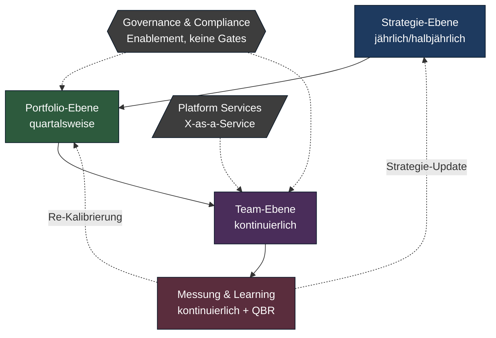
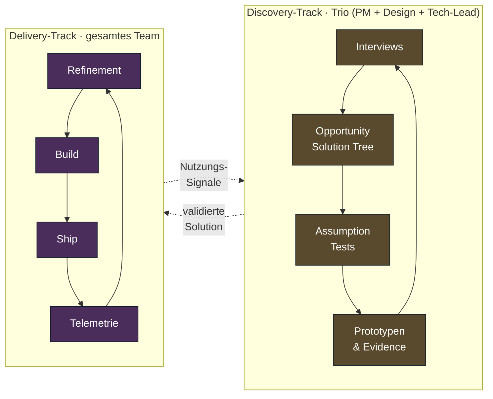
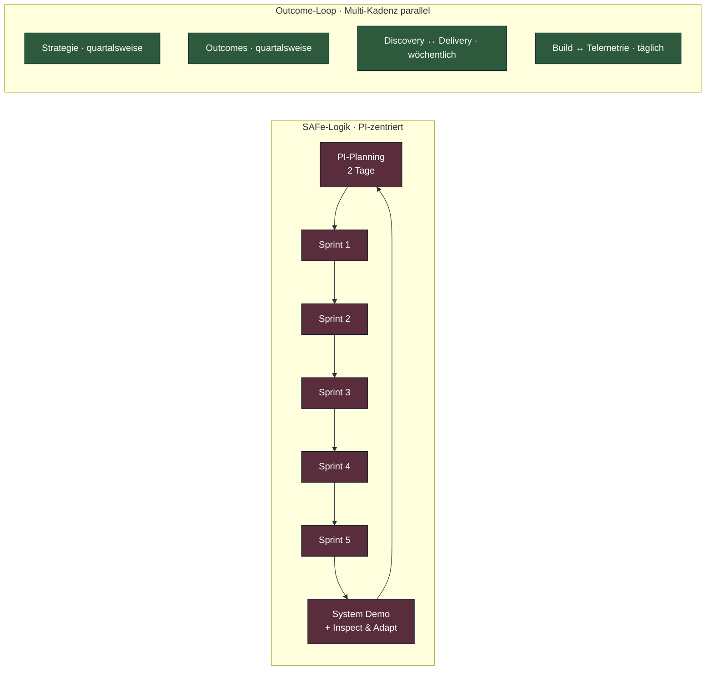

# Der Enterprise Outcome-Loop

**Das Gegenmodell zu SAFe: Produktentwicklung als kontinuierlicher Lern-Kreislauf, nicht als Quartals-Choreografie.**

Lesezeit: ~10 Min
Serie: [Übersicht](index.md) · Teil 2 von 5

---

## Anschluss: vom Problem zum Gegenmodell

Im ersten Teil haben wir die Diagnose gestellt: SAFe und seine Verwandten verwechseln *Skalierung von Prozessen* mit *Skalierung von Lernen*. Sie inszenieren Synchronisation über Kalender — PI-Planning alle zehn Wochen, Quartals-Reviews, ART-Sync. Das Ergebnis ist eine Choreografie aus Meetings, die Bewegung simuliert, aber keine Wirkung erzeugt. Features werden geliefert, Ziele werden gemeldet, und niemand kann sagen, ob sich am Markt tatsächlich etwas verändert hat.

Die naheliegende Reaktion in Konzernen lautet: noch mehr Prozess. Mehr Cadences. Mehr Rollen. Mehr Tooling. Das macht das Problem schlimmer, weil es die falsche Grundannahme verstärkt — die Annahme nämlich, dass Produktentwicklung ein **planbarer Prozess** sei, den man durch besseres Projektmanagement in den Griff bekommt.

Sie ist es nicht. Produktentwicklung ist ein **Erkenntnisprozess unter Unsicherheit**. Und Erkenntnisprozesse skalieren anders als Fabriken.

Dieser Beitrag liefert das Gegenmodell: den **Enterprise Outcome-Loop**. Es ist kein neues Framework, sondern eine Synthese aus etablierten Praktiken — Cagans Product Operating Model, Skelton/Pais' Team Topologies, Torres' Continuous Discovery, Wodtkes OKR-Lesart, Perris Build-Trap-Analyse. Verdichtet zu einem Referenz-Zyklus, der in 500+-Personen-Organisationen mit Compliance, Multi-BU-Struktur und Legacy funktioniert.

## Die Kernthese

**Produktentwicklung ist ein kontinuierlicher Lern-Kreislauf, kein linearer Prozess.** Synchronisation entsteht durch geteilte Outcomes, nicht durch Kalender.

Das ist keine rhetorische Spielerei. Es hat operative Konsequenzen:

- Wer Outcomes teilt, braucht keine PI-Planning-Events, um Abhängigkeiten zu klären — die Abhängigkeiten ergeben sich aus dem Ziel.
- Wer kontinuierlich lernt, friert Strategie nicht jährlich ein — sondern kalibriert sie quartalsweise gegen Evidenz.
- Wer Erkenntnis als Ergebnis behandelt, misst nicht Velocity oder Story Points — sondern Wirkung auf North-Star- und Input-Metriken.

Der Loop hat **vier Ebenen** und zwei **Cross-Cutting-Layer**. Sehen wir uns die vereinfachte Variante an, bevor wir tiefer einsteigen:

Vier Ebenen, vier unterschiedliche Kadenzen — aber ein gemeinsames Ziel: dass die Organisation die *gleiche* Realität wahrnimmt und in unterschiedlicher Geschwindigkeit darauf reagieren kann. Wir gehen sie nun einzeln durch.

## Ebene 1: Strategie — jährlich bis halbjährlich

Auf der obersten Ebene leben drei Artefakte: **Vision**, **North Star Metric** und **Produkt-Strategie**.

Die Vision beantwortet *Wo wollen wir hin?* — über einen Horizont von drei bis zehn Jahren. Sie ist bewusst weniger detailliert als ein Strategie-Dokument, dafür langlebiger. Cagan nennt sie "Strong Product Vision". Die North Star Metric übersetzt die Vision in eine einzige Zahl, die langfristig stimmen muss — bei Spotify Listening Time, bei Airbnb Nights Booked, bei einem B2B-SaaS oft Active Workflows. Dazu kommen zwei bis fünf **Input-Metriken**, die die North Star kausal treiben.

Die Produkt-Strategie beantwortet die Frage *Wo spielen wir und wo nicht?* — also Fokus. Sie ist explizit eine **Wette auf wenige Hebel**, nicht eine vollständige Abdeckung aller möglichen Märkte. Wodtke und Doerr nennen das "Radical Focus", Cagan "Insights → Focus → Bets". Wer auf dieser Ebene alles will, gewinnt nichts.

Was ist *nicht* auf dieser Ebene: konkrete Features, Termine, Team-Allokationen. Diese Dinge gehören eine Etage tiefer. Wenn die Strategie-Ebene anfängt, Features zu listen, wird sie zur Roadmap im Tarnanzug, und das Portfolio-Layer wird redundant.

## Ebene 2: Portfolio — quartalsweise

Hier wird die Strategie in **Outcome-Ziele**, **Bets** und **Team-Topologie** übersetzt. Das ist die operativ wichtigste Ebene, weil sie die Brücke zwischen "Wo wollen wir hin?" und "Was tun wir morgen?" baut.

**Outcome-Ziele** sind quartalsweise OKRs, formuliert als messbare Hypothesen: *Wir glauben, dass Reduktion der Onboarding-Zeit um 40 % die 30-Tage-Retention um 8 Prozentpunkte steigert.* Nicht: *Wir launchen Onboarding-Redesign in Q3.* Der Unterschied ist nicht semantisch, er ist operativ — die erste Formulierung lässt sich falsifizieren, die zweite nicht.

**Bets** sind Investitions-Entscheidungen mit explizitem Konfidenz-Level. *Bet A: Onboarding-Redesign, Confidence high, 1 Team-Quartal. Bet B: Pricing-Experiment, Confidence medium, 0.5 Team-Quartale.* Bets bündeln Outcomes in finanzierbare Einheiten und schaffen Sprache zwischen Produkt und Finance. Janna Bastow nennt das den "Now-Next-Later"-Horizont — Now hat hohe Schärfe, Later bewusst nur grobe Richtung.

**Team-Topologie** ist der dritte Output dieser Ebene und wird oft übersehen. Skelton und Pais zeigen, dass Outcomes nicht losgelöst von Team-Struktur existieren: Wer einen Outcome im Checkout-Bereich braucht, muss prüfen, ob es ein **Stream-aligned Team** für Checkout gibt — oder ob die Verantwortung auf vier Teams verteilt ist. Wenn Letzteres, ist der Outcome de facto unlösbar, bis die Topologie angepasst wird. Quartalsweise Reviews der Topologie sind deshalb keine Org-Bürokratie, sondern strategische Hygiene.

## Ebene 3: Team — kontinuierlich

Hier wird das Modell konkret. Jedes Stream-aligned Team betreibt zwei parallele Tracks, die voneinander lernen:

Der **Discovery-Track** validiert kontinuierlich, *was* gebaut werden sollte. Customer-Interviews wöchentlich (Torres empfiehlt minimum drei pro Woche, Trio-Format), Pflege des Opportunity-Solution-Trees, Assumption-Tests, Prototyping. Output: Solution-Konzepte mit Evidence.

Der **Delivery-Track** liefert das Validierte — in Sprints, Flow oder Cycles, je nach Team-Stil. Output: deployed Code und Telemetrie. Wichtig: **Deployment ist nicht Release.** Feature Flags entkoppeln das Hochrollen von Code vom Hochrollen für Nutzer.

Die beiden Tracks sind keine Stafetten. Sie laufen kontinuierlich parallel und tauschen Signale aus: Discovery schickt validierte Solutions ins Backlog, Delivery schickt Nutzungs-Telemetrie zurück in Discovery. Wer das als sequenziell missversteht — *erst Discovery-Phase, dann Delivery-Phase* — landet im klassischen Wasserfall mit anderem Namen.

Eine häufige Anti-Pattern-Frage: *Wer macht das, wenn nicht der PM allein?* Antwort: das **Product Trio** — Product Manager, Product Designer, Tech-Lead. Wenn nur der PM Discovery macht, gibt es keinen Track, sondern einen Engpass.

## Ebene 4: Messung & Learning

Die vierte Ebene ist der Lern-Apparat. Drei Komponenten:

- **Produkt-Telemetrie:** Analytics, A/B-Tests, Cohort-Analysen — quantitatives Signal.
- **Qualitatives Feedback:** Interviews, Support-Themen, NPS-Verbatims — Bedeutungsschicht hinter den Zahlen.
- **Quarterly Business Review (QBR):** strukturiertes Lern-Event pro Quartal, in dem Outcomes gegen Hypothesen geprüft werden.

Der QBR ist nicht zu verwechseln mit dem Status-Theater, das in vielen Konzernen unter dem Namen läuft. Im Outcome-Loop ist QBR ein **Lern-Format**: Was haben wir gewettet? Was ist passiert? Was wissen wir jetzt, das wir vor 90 Tagen nicht wussten? Welche Bets behalten wir, welche stoppen wir, welche neuen kommen dazu? Wer das ehrlich macht, killt regelmäßig Bets, die zu Anfang plausibel klangen. Das ist gewünscht.

## Die Cross-Cutting-Layer: Governance und Platform

Zwei Layer durchziehen alle Ebenen: **Governance/Compliance** und **Platform Services**.

In klassischen Konzernen sind beide das, was den Loop in der Praxis kaputt macht. Legal blockt Experimente. Security veto't Deployments. Architecture-Boards schreiben Lösungen vor, bevor Discovery überhaupt begonnen hat. Platform-Teams werden als "Ops-Team" missverstanden, das Tickets abarbeitet, statt Plattformen zu produktisieren.

Das Outcome-Loop-Modell hat eine klare Antwort darauf: Beide Layer müssen **Enablement** sein, keine Gates.

- **Governance als Enablement** bedeutet: Compliance liefert Leitplanken und Selbstbedienungs-Checks, statt Reviews zu erzwingen. Security-by-Design-Patterns ersetzen Security-Reviews am Ende. Architecture publiziert Reference Implementations, statt Approvals zu verteilen.
- **Platform als Enablement** bedeutet: das Platform-Team baut die Plattform als **Produkt** mit Stream-Teams als Kunden. Selbstbedienung, Doku, SLOs, Cognitive-Load-Reduktion. "X-as-a-Service" im Sinne von Skelton/Pais.

Beide Layer haben damit eigene Produkt-Logik: Sie haben Kunden (die Stream-Teams), sie haben Outcomes (Time-to-First-Deploy, Inzident-Rate, Compliance-Coverage), und sie sind Teil des Loops, nicht außerhalb.

## Die fünf Schleifen: Kadenzen im Überblick

Der Loop ist keine eine Schleife, sondern **fünf ineinander verschachtelte Schleifen** mit unterschiedlichen Kadenzen. Was in jeder gelernt wird:

| Schleife              | Kadenz             | Was wird gelernt                          |
|-----------------------|--------------------|-------------------------------------------|
| Strategie ↻ Review    | quartalsweise      | Spielen wir noch auf dem richtigen Feld?  |
| Outcomes ↻ Bets       | quartalsweise      | Wirken unsere Investitionen?              |
| Discovery ↻ Delivery  | wöchentlich        | Stimmt unsere Lösungs-Hypothese?          |
| Build ↻ Telemetrie    | täglich/continuous | Funktioniert das Feature in echt?         |
| Interview ↻ OST       | wöchentlich        | Verstehen wir das Kunden-Problem richtig? |

Jede Schleife hat ihre eigene Geschwindigkeit. Die schnellste — Build/Telemetrie — schließt im Continuous-Deployment-Stil mehrmals täglich. Die langsamste — Strategie — schließt vier Mal im Jahr. Dazwischen liegen die Discovery- und Outcome-Schleifen.

Das ist der zentrale Unterschied zu SAFe. In SAFe ist die dominante Kadenz das Program Increment: zehn Wochen mit eingefrorenem Plan und großem Synchronisations-Event am Anfang. Im Outcome-Loop gibt es **keine dominante Kadenz**. Jede Schleife dreht in ihrer eigenen Geschwindigkeit, und die Synchronisation entsteht dadurch, dass alle auf dieselben Outcomes hinarbeiten.

Optisch wirkt das chaotischer. Operativ ist es entspannter, weil niemand auf das nächste PI-Planning warten muss, um eine offensichtlich falsche Bet zu stoppen.

## Was der Loop *nicht* ist

Drei häufige Missverständnisse — und warum sie das Modell zerstören:

**Kein Phasenmodell.** Strategie, Portfolio, Team und Messung laufen *kontinuierlich parallel*, nicht in Stage-Gate-Sequenz. Wer aus Ebene 1 → 2 → 3 → 4 ein Wasserfall-Diagramm macht, hat den Loop nicht verstanden. Die Pfeile gehen in beide Richtungen, und alle Ebenen sind ständig aktiv.

**Kein Top-Down-Apparat.** Die Strategie-Ebene setzt **Leitplanken**, nicht **Lösungen**. Welche Bets im Quartal angegangen werden, hängt von Evidence ab, nicht von Direktive. Empowerment ist hier kein weiches Wort, sondern operative Bedingung — ohne sie funktioniert die Team-Ebene nicht.

**Kein Skalierungs-Framework.** Es gibt im Outcome-Loop kein PI-Planning, keine ART-Sync, keinen Release-Train. Synchronisation entsteht über *geteilte Outcomes* und über *X-as-a-Service-Plattformen*, nicht über Kalender-Events. Das skaliert besser, weil die Koordinations-Kosten linear bleiben, statt quadratisch zu wachsen.

Wer den Loop als "SAFe-aber-mit-Outcomes" einführt, kriegt das Schlechteste aus beiden Welten. Es ist ein anderes Modell — kein anderes Etikett.

## Was das in der Praxis kostet

Eine ehrliche Vorbemerkung, bevor wir im nächsten Teil vertiefen: Das Outcome-Loop-Modell ist nicht *leichter* einzuführen als SAFe. Es ist **anders schwer**.

SAFe ist prozedural schwer — viele Rollen, viele Events, viel Schulung. Aber es lässt die Macht-Verteilung weitgehend intakt: Manager bleiben Manager, Steuerung bleibt zentral, Kontrolle bleibt sichtbar.

Der Outcome-Loop ist kulturell schwer. Er verlangt, dass Leadership tatsächlich Macht abgibt — an Trios, die Solutions entscheiden. Dass Finance lernt, in Bets statt in Termin-Versprechen zu denken. Dass Governance sich als Service versteht, nicht als Wächter. Dass PMs echte Senioren sind, mit Kundenzugang und Mandat.

Das ist viel verlangt. In den meisten 500+-Organisationen ist es eine Mehrjahres-Transformation, kein Tooling-Switch. Cagans *Transformed* (2024) ist genau dafür das Playbook.

Aber: Es funktioniert. Und es funktioniert in einer Größenordnung, in der SAFe nachweislich nur Beschäftigung produziert.

## Ausblick: Teil 3 — Discovery-Track

Der Discovery-Track ist das Herz dieses Modells. Hier entscheidet sich, ob die Outcome-Logik funktioniert oder zu einem neuen Feature-Theater wird. Im nächsten Teil schauen wir uns Continuous Discovery im Detail an: Wie ein Trio mit drei Interviews pro Woche eine Opportunity-Solution-Tree pflegt, welche Assumption-Tests in welcher Reihenfolge sinnvoll sind und wie Discovery in einem Enterprise-Kontext mit Compliance-Anforderungen funktioniert.

Vorab eine These, die wir dort begründen werden: **Wenn dein Team nicht mindestens drei Customer-Touchpoints pro Woche hat, hast du keinen Discovery-Track. Du hast einen Backlog mit Stakeholder-Wünschen.**

---

## Quellen

- Cagan, Marty: *Inspired* (2017), *Empowered* (2020), *Transformed* (2024). Silicon Valley Product Group.
- Torres, Teresa: *Continuous Discovery Habits* (2021). Product Talk.
- Skelton, Matthew & Pais, Manuel: *Team Topologies* (2019). IT Revolution.
- Wodtke, Christina: *Radical Focus* (2nd ed., 2021). Cucina Media.
- Perri, Melissa: *Escaping the Build Trap* (2018). O'Reilly.
- Bastow, Janna: Strategic Roadmaps (ProductPlan / Mind the Product Material).
- Repository-Quelle: [`docs/cycle/enterprise-outcome-loop.md`](../cycle/enterprise-outcome-loop.md)
- Methodenprofile: [Product Operating Model](../methods/modern/product-operating-model.md) · [Team Topologies](../methods/modern/team-topologies.md) · [Outcome-based Roadmapping](../methods/modern/outcome-roadmapping.md) · [Dual-Track Agile](../methods/discovery/dual-track-agile.md)

---

← Vorheriger Teil: [Warum SAFe nicht](01-warum-safe-nicht.md)
→ Nächster Teil: [Discovery-Track](03-discovery-track.md)
