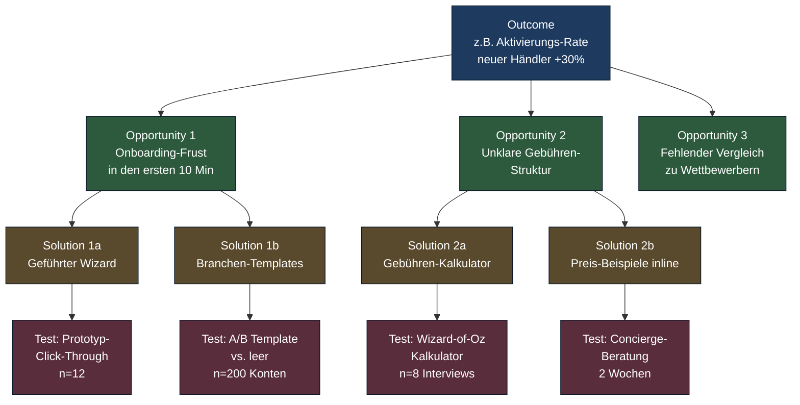
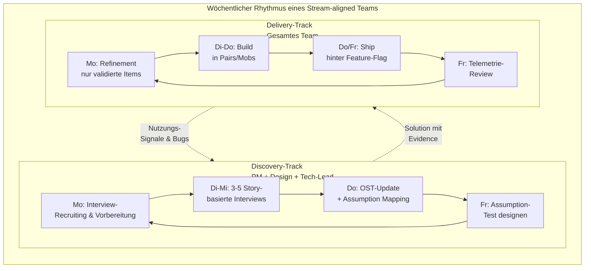
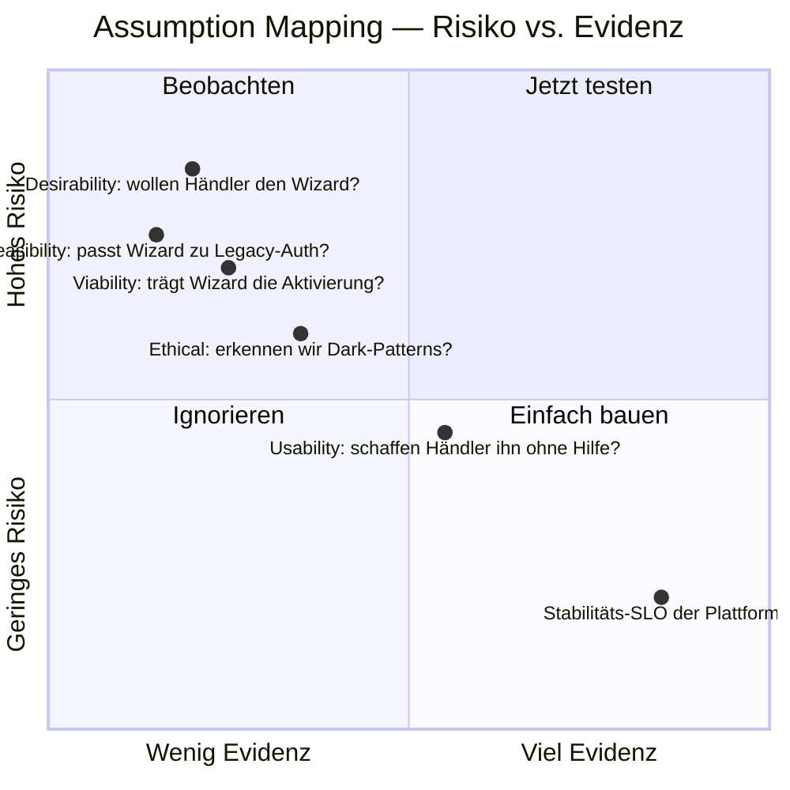
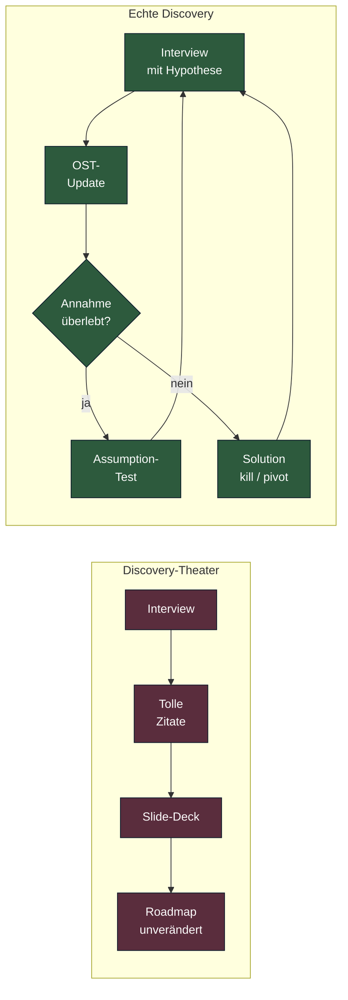

# Discovery-Track: lernen, bevor man baut

**Wie moderne Produktteams Probleme verstehen und Lösungen validieren — als wöchentliche Gewohnheit, nicht als Projektphase.**

Lesezeit: ~10 Min
Serie: [Übersicht](index.md) · Teil 3 von 5

---

Im vorigen Teil haben wir den Enterprise-Outcome-Loop als Ganzes gezeichnet: Strategie kalibriert Outcomes, Outcomes finanzieren Bets, Bets landen in langlebigen Teams, Teams lernen über zwei Tracks — Discovery und Delivery. Dieser Post nimmt sich den linken Track vor. Den, den die meisten Enterprises systematisch unterschätzen, obwohl er der teuerste Hebel im ganzen Modell ist.

Eine bittere Wahrheit zuerst: Wenn dein Team in den letzten drei Quartalen Features ausgeliefert hat, deren Nutzung im Telemetrie-Dashboard unter zehn Prozent der Zielgruppe blieb, hattest du kein Delivery-Problem. Du hattest ein Discovery-Problem. Und es ist sehr wahrscheinlich, dass du das nicht weißt, weil niemand die Nutzung systematisch nach Hypothesen aufschlüsselt.

## Discovery ist keine Phase

Die häufigste Verwechslung in deutschen Konzernen lautet: "Discovery machen wir vor dem Sprint." Das ist falsch und stammt aus einer Welt, in der "Anforderung" und "Implementierung" säuberlich trennbar waren. In modernen Produktteams läuft Discovery parallel zur Delivery, kontinuierlich, in derselben Woche, im selben Team. Teresa Torres nennt das *Continuous Discovery Habits*. Marty Cagan nennt es Dual-Track. Beide meinen dasselbe: Discovery ist eine **Gewohnheit**, kein Meilenstein.

Eine Gewohnheit hat Frequenz. Im Discovery-Track heißt das: mindestens **ein Kunden-Touchpoint pro Woche**, **ein Update am Opportunity Solution Tree**, **mindestens ein Assumption-Test pro Bet**. Wer diese Frequenz unterschreitet, betreibt keine Discovery. Er betreibt Brainstorming mit Belegen aus dem letzten Jahr.

Warum diese Tonlage so hart? Weil "Discovery, wenn Zeit ist" in der Praxis "nie" bedeutet. Wenn Discovery keinen festen Platz im Wochenkalender hat, gewinnt immer das nächste Stakeholder-Meeting. Das ist kein moralisches Versagen — es ist Organisationsphysik.

## Drei Methoden, die zusammen funktionieren

Der Discovery-Track besteht aus drei klar voneinander unterscheidbaren Bausteinen, die sich in der Praxis verzahnen. Wer einen davon weglässt, bekommt ein erkennbares Anti-Pattern. Wer alle drei in Reinform parallel betreibt, ohne sie zu integrieren, bekommt Workshop-Tourismus.

**Continuous Discovery** (Torres) liefert die **Kadenz und das zentrale Artefakt**: den Opportunity Solution Tree. Outcome oben, darunter verzweigt sich der Problem-Raum in Opportunities (Kunden-Bedürfnisse, Pain Points, gewünschte Fortschritte), darunter konkrete Solutions, ganz unten die Assumption Tests, die diese Solutions absichern. Der Baum ist kein Dokument für die Wiki-Beerdigung, sondern ein Arbeitsdokument, das sich nach jeder Interview-Woche verändert. Eine pragmatische Regel: wenn der OST älter als zwei Wochen ist, ist er Folklore.

**Dual-Track Agile** (Cagan, Patton, ursprünglich Desirée Sy) liefert die **Organisationsform im Team**: dieselbe Triade — PM, Design, Tech-Lead — führt Discovery, das gesamte Team führt Delivery. Discovery-Output sind nicht Tickets, sondern *evidenz-basierte Solution-Konzepte*, die ins Refinement gehen, wenn sie überleben.

**Jobs-to-be-Done** (Christensen, Ulwick, Klement) liefert die **Sprache und Diagnostik vor dem Tree**: Was ist eigentlich der Fortschritt, den der Kunde unter welchen Umständen sucht? Welcher konkurrierende "Job" wird gerade durch unsere Lösung verdrängt — oder eben nicht? JTBD verhindert, dass der OST mit Personas und Demografie startet und damit das Wesentliche überspringt. Praktisch: ein einzelnes, sauber formuliertes Job-Statement pro Stream-Team ("When [Situation], I want to [Motivation], so I can [erwarteter Fortschritt]") wirkt wie ein Strategie-Filter für alle nachgelagerten Opportunities.

Lies den Baum von oben nach unten als Hypothesen-Kette: *Wenn wir Outcome X erreichen wollen, glauben wir, dass Opportunity Y die größte Hebelkraft hat; wir vermuten Solution Z, und wir wissen es, wenn Assumption-Test A das Ergebnis E zeigt.* Jede Ebene ist falsifizierbar. Wenn nicht — zurück an den Baum.

## Der konkrete Wochenrhythmus

Wie sieht das in der Realität eines Stream-Teams aus, das auf eine Quartals-Outcome eingeschworen ist? Nicht als Idealbild, sondern als Mindest-Frequenz, mit der der Loop läuft:

Drei Beobachtungen zu diesem Rhythmus:

Erstens: Die **Triade** macht Discovery zusammen. Nicht der PM allein, dem Design und Engineering später "berichtet" wird. Wenn der Tech-Lead nicht im Interview saß, kann er die Machbarkeit nicht ehrlich einschätzen — er rät. Wenn Design nicht dabei war, baut es Lösungen für ein gefiltertes Problem.

Zweitens: **Refinement nimmt nur Items aus dem Discovery-Output an.** Stakeholder-Wünsche, die nicht durch den Tree gelaufen sind, werden zurückgespielt — als Opportunity-Kandidaten, nicht als Tickets. Klingt politisch riskant, ist es auch. Es ist der einzige Weg, das Anti-Pattern "Discovery liefert Insights, Delivery baut anderes" zu vermeiden.

Drittens: **Telemetrie schließt den Loop am Freitag**, nicht im nächsten Quartals-Review. Wer ein Feature ausgeliefert hat und am Freitag keine Aktivierungs- oder Nutzungs-Zahl sehen kann, hat einen Outcome-blinden Build-Cycle.

## Assumption Mapping in der Praxis

Bevor man eine Solution baut, wird sie als Bündel von Annahmen entlang fünf Achsen seziert. Torres und Cagan benennen die Kategorien minimal unterschiedlich; in deutscher Praxis hat sich folgendes Fünferpack etabliert:

Die fünf Achsen — kurz und unmissverständlich:

- **Desirable** — Wollen Nutzer es überhaupt? Test: Story-Interviews zum aktuellen Job, Prototyp-Click-Through, gefälschte Türen.
- **Viable** — Trägt es Geschäft, Strategie, Regulatorik? Test: Business-Case mit ehrlichen Kannibalisierungs-Annahmen, Legal-Review früh.
- **Feasible** — Können wir es mit unserem Stack und Skills bauen? Test: Spike, Architektur-Review, Plattform-Team konsultieren.
- **Usable** — Schaffen es Nutzer ohne Hand-Holding? Test: moderierte Usability mit fünf Nutzern, klassischer Krug-Standard.
- **Ethical** — Ist es zumutbar? Test: Dark-Pattern-Audit, Inclusion-Review, Auswirkung auf vulnerable Gruppen.

Wer keine Achse als hochriskant markieren kann, hat das Mapping nicht ernst gemacht. Eine ehrliche Map identifiziert pro Solution zwei bis vier *Killer-Annahmen* — die, deren Falsifikation die Solution unbrauchbar macht. Diese kommen zuerst dran, nicht die einfach testbaren.

## Drei Anti-Patterns, die jeden Discovery-Track erledigen

In zehn von zehn Transformationen, die ich begleite, taucht mindestens eines dieser drei Muster auf. Meist alle drei.

**Discovery-Theater.** Das Team interviewt fleißig sechs Kunden pro Monat, präsentiert das in Townhalls — und der OST sieht im Dezember aus wie im März. Interviews ohne Hypothesen-Update sind Catering. Der Test, ob Discovery echt ist: *Welche Annahme habt ihr in den letzten vier Wochen aufgegeben?* Wenn die Antwort "keine" lautet, lernt das Team nicht; es bestätigt sich.

**PM als Engpass.** Der PM macht alle Interviews allein, schreibt Notizen, deutet, präsentiert. Design und Engineering hören Zusammenfassungen. Das ist keine Dual-Track — das ist Wasserfall in agiler Verkleidung. Konsequenz: Engineering misstraut den Insights, Design entwirft am Problem vorbei, der PM brennt aus. Heilmittel: Triade als Standard, Notizen rotieren, jeder im Trio führt mindestens ein Interview im Monat selbst.

**Two-Speed-Disconnect.** Discovery findet statt, Delivery findet statt — aber sie reden nicht miteinander. Der Backlog füllt sich aus Stakeholder-Mails, der OST hängt schmückend an der Wand. Symptom: in der Sprint-Review sind Discovery-Erkenntnisse nie zitiert; im OST tauchen keine Items auf, die das Delivery-Team gerade baut. Heilmittel: explizite Definition of Ready, die fordert, dass jedes größere Item entweder aus dem OST stammt oder als Hypothese formuliert ist; PMs verteidigen das auch gegen Vorstands-Wünsche. Eine sichtbare Kennzahl hilft: *Anteil der gelieferten Story-Punkte mit OST-Bezug pro Sprint*. Unter 70 Prozent ist Alarm.

## Was es vom PM, vom Team — und vom Management — verlangt

Continuous Discovery ist keine Methode, die man kauft, sondern eine Praxis, die strukturelle Voraussetzungen hat. Wer drei davon nicht liefert, sollte sich den ganzen Track sparen.

**Zugang zu Kunden.** In B2C trivial, in B2B mit Compliance-Schicht harte Arbeit. Bei zehn oder mehr Teams braucht es eine **Research-Operations-Funktion**: zentrale Recruiting-Datenbank, DSGVO-konforme Einverständnis-Pipelines, Anreiz-Modelle. Ohne ResOps wird jeder PM zum Recruiter. Das ist nicht das Engpass-Modell, das du willst.

**Mut zum Killen.** Ein Discovery-Track, der nichts beerdigt, ist kein Discovery-Track. Wenn dein Lead-PM in den letzten zwei Quartalen keine einzige Solution gestoppt hat, prüf, ob die Anreize stimmen — wahrscheinlich werden im Performance-Review Outputs belohnt, nicht Outcomes. Christina Wodtkes Formulierung: *Schlechte Ideen früh sterben lassen ist das eigentliche Produkt von Strategie.*

**Disziplin in der Dokumentation.** Der OST muss leben, nicht im Confluence verstauben. Eine pragmatische Heuristik: maximal eine Stunde Pflege pro Woche, dafür konsequent. Interviews werden als 2-3-Bullet-Insights mit Datum und Hypothesen-Bezug erfasst — nicht als 20-seitige Transkripte, die nie wieder gelesen werden.

**Vom Management:** Schutz der Frequenz. Wenn Discovery-Wochen-Slots regelmäßig für "wichtige Stakeholder-Demos" gekapert werden, signalisiert die Org-Spitze, dass Discovery verzichtbar ist. Sie wird verzichtbar. Cagans Formulierung dafür ist ungnädig: *Wenn die Leadership nicht versteht, was empowerte Teams brauchen, hat sie keine empowerten Teams.*

## Was Discovery *nicht* ist

Damit der Track im Enterprise nicht zur Beliebigkeits-Wiese wird, drei klare Abgrenzungen:

- **Kein Marktforschungs-Ersatz.** Discovery liefert tiefe Insights zu wenigen Nutzern; Marktforschung liefert breite Aussagen zu vielen. Beides nötig — auf unterschiedlichen Ebenen des Loops.
- **Kein Design-Sprint-Marathon.** Design Sprints (Knapp) sind ein hervorragendes Werkzeug für Punkt-Probleme. Sie ersetzen keine wöchentliche Discovery-Praxis. Wer alle drei Monate einen Sprint einlegt, hat keine Continuous Discovery.
- **Kein Innovations-Hub-Privileg.** Discovery gehört in jedes Stream-Team, nicht in eine separate "Innovation Unit". Eine getrennte Innovation Unit ist das organisationale Eingeständnis, dass die Stream-Teams es nicht dürfen oder können — eine Diagnose, kein Modell.

## Brücke zu Post 4

Discovery braucht zwei Voraussetzungen, die der Track selbst nicht stellt: die richtige **Org-Struktur**, in der Stream-Teams überhaupt langlebig und mit Mandat existieren — und das passende **Operating Model**, das Outcomes, Ressourcen und Empowerment in eine konsistente Sprache bringt. Genau das ist Thema von Teil 4: Team Topologies und das Product Operating Model als tragende Architektur. Ein Discovery-Track ohne diese Träger zerfällt in vier Quartalen — ich habe es mehrfach gesehen.

---

## Quellen

- Teresa Torres: *Continuous Discovery Habits*
- Marty Cagan: *Inspired*, *Empowered*, *Transformed*
- Jeff Patton: *User Story Mapping*
- Clayton Christensen et al.: *Competing Against Luck*
- Anthony Ulwick: *Jobs to be Done: Theory to Practice*
- Alan Klement: *When Coffee and Kale Compete*
- Eric Ries: *The Lean Startup* (für Assumption-Test-Vokabular)
- Desirée Sy: Originalpapier zur Dual-Track-Idee (Autodesk)

← Vorheriger Teil: [Outcome-Loop](02-enterprise-outcome-loop.md)
→ Nächster Teil: [Team Topologies + POM](04-team-topologies-pom.md)
