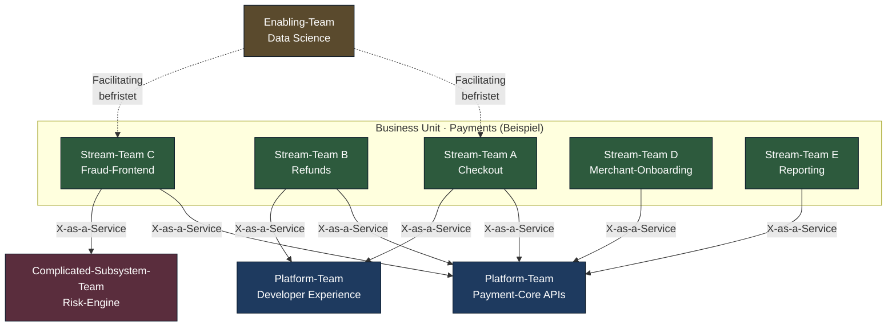
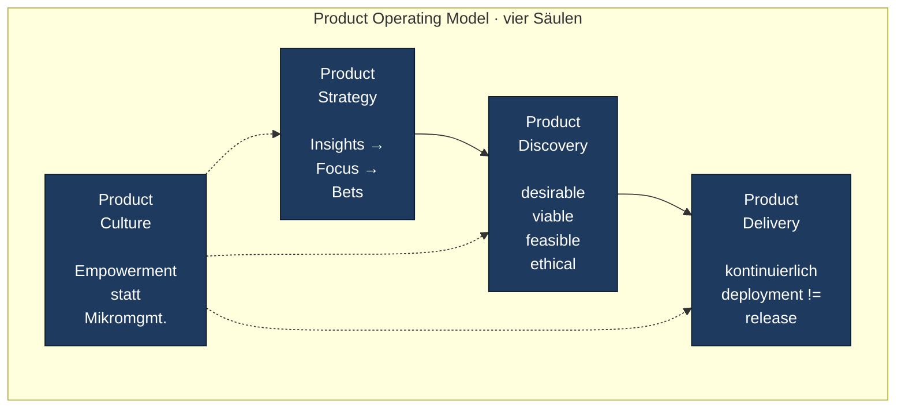
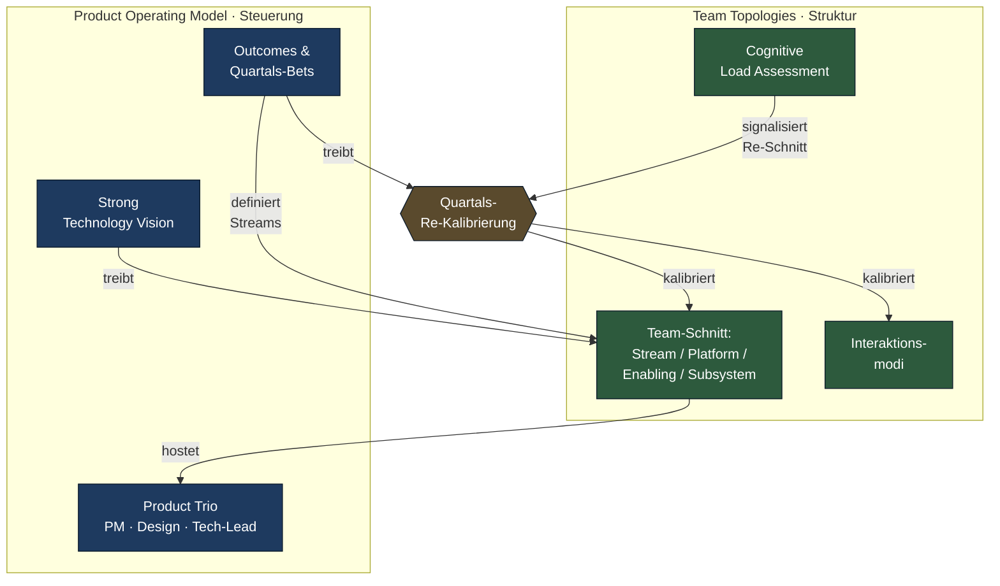

# Team Topologies + Product Operating Model: Org-Design ohne SAFe-Apparat

*Wie du eine 500-Personen-Org so schneidest, dass empowerte Teams überhaupt eine Chance haben — strukturell sauber, ohne Skalierungs-Schwergewicht.*

Lesezeit: ~10 Min · Serie: [Übersicht](index.md) · Teil 4 von 5

---

## Wo wir stehen

Im [vorigen Teil](03-discovery-track.md) ging es um den Discovery-Track: wie ein Team kontinuierlich lernt, *was* zu bauen sich lohnt. Dual-Track Agile, Continuous Discovery, Opportunity Solution Trees. Das alles funktioniert — in *einem* Team. Sobald du fünf, zwanzig oder fünfzig solche Teams hast, ändert sich die Frage.

Sie lautet nicht mehr: "Wie arbeitet das Team?" Sondern: "Wie sind die Teams zueinander geschnitten, damit der Discovery-Loop überhaupt offen bleibt?"

Das ist der strukturelle Teil. Und genau hier kippt 90 % der Enterprise-Welt in SAFe — weil SAFe eine *Antwort* auf diese Frage liefert. Eine schlechte Antwort. In diesem Post zeige ich dir die bessere: **Team Topologies** für die Struktur, **Product Operating Model** für die Steuerung. Beides zusammen ersetzt den Skalierungs-Apparat. Beides einzeln scheitert.

---

## Das Skalierungs-Problem, ehrlich

Bevor wir über Lösungen reden, lass uns das Problem nicht romantisieren. Skalierung ist nicht "mehr vom Gleichen". Sie ist ein Phasenübergang.

- **5 Teams** lassen sich noch durch geteilte Kultur und ein gemeinsames Slack-Channel koordinieren. Die Architektur ist überschaubar, jeder kennt jeden, das Org-Chart ist eine Fußnote.
- **50 Teams** brauchen explizite Schnittstellen. Wer hängt von wem ab? Wer betreibt welche Komponente? Wer entscheidet, wenn zwei Teams das gleiche Stück Code anfassen wollen? Spontane Koordination skaliert nicht. Sie wird zur Vollzeitarbeit.
- **500 Personen** — also realistisch 40 bis 60 Teams plus Funktionen — heißt: das Org-Design *ist* die Architektur. Conway's Law ist hier kein Bonmot mehr, sondern Tagesgeschäft. Jede Org-Linie wird sich als API-Grenze materialisieren, ob du das willst oder nicht.

Was an dieser Stelle typischerweise bricht: Abhängigkeiten explodieren, Übergabe-Latenzen wachsen, kognitive Last pro Team steigt unkontrolliert, und Teams verlieren das Gefühl, *einen* Stream zu besitzen. Die übliche Reaktion ist ein Skalierungs-Framework als Pflaster. PI-Planning. Release Trains. Quartals-Synchronisation. Synchronisation als Ersatz für gutes Schneiden.

Die bessere Antwort: **die Org so schneiden, dass sie weniger Synchronisation braucht.**

---

## Team Topologies: die Sprache, die in deinem Org-Chart fehlt

Skelton und Pais haben 2019 mit *Team Topologies* das geliefert, was vorher fehlte — eine **gemeinsame Sprache** für Org-Design, die so präzise ist, dass man in der Diskussion nicht mehr in "Squads", "Tribes" und "Chapters" abrutscht.

### Die vier Team-Typen



- **Stream-aligned Team** — liefert wertorientiert auf einen einzigen Business-Stream. Default-Team. In einer gesunden Org sollten mindestens drei Viertel aller Teams stream-aligned sein.
- **Platform-Team** — reduziert kognitive Last für Stream-Teams, indem es kompoundierende Fähigkeiten als *Produkt* anbietet ("Platform-as-a-Service"). Wichtig: das Stream-Team ist Kunde, nicht Ticket-Einreicher.
- **Enabling-Team** — temporäre Coaching-Mission. Bringt ein Stream-Team über eine Lernkurve (z.B. ML-Integration, neue Test-Praxis), und zieht sich dann zurück.
- **Complicated-Subsystem-Team** — eine spezialisierte Tiefendomäne, die so viel Vorwissen verlangt, dass es sich nicht lohnt, dieses Wissen auf alle Stream-Teams zu verteilen. Beispiel: Risk-Engine, Video-Codec, Krypto-Modul.

### Die drei Interaktionsmodi

Genauso entscheidend wie die Team-Typen ist, *wie* sie miteinander reden:

- **Collaboration** — hochbandbreitig, temporär, gemeinsame Verantwortung. Teuer. Soll selten und gezielt eingesetzt werden.
- **X-as-a-Service** — produktisierte Schnittstelle, klare API, geringer Kommunikations-Overhead. Der Default zwischen Stream- und Platform-Team.
- **Facilitating** — Enabling-Team unterstützt für eine begrenzte Zeit. Endet mit messbarer Lern-Übergabe.

### Cognitive Load als Designgröße

Der vielleicht radikalste Beitrag von Team Topologies: **kognitive Last ist endlich**. Ein Team kann nicht beliebig viele Domänen, Services und Technologien gleichzeitig im Kopf haben. Wenn das Team-API "wir machen alles" ist, kann es niemand bedienen — auch das Team selbst nicht.

Praktisch heißt das: Wenn du beim Team-Schnitt anfängst zu spüren, dass ein Team "noch ein bisschen das" und "auch noch das" übernimmt, ist es überlastet. Schneide es. Lieber kleiner Stream-Schnitt mit Klarheit als großer Schnitt mit Erschöpfung.

### Conway's Law als Werkzeug

Conway hat 1968 beschrieben, dass Software-Systeme die Kommunikationsstrukturen ihrer bauenden Organisationen widerspiegeln. Team Topologies dreht das um: Wenn die Architektur sowieso die Org-Struktur abbildet — *dann schneide die Org so, wie du die Architektur haben willst*. Inverse Conway. Org-Design wird Architektur-Design.

---

## Product Operating Model: die Steuerung über der Struktur

Team Topologies allein gibt dir saubere Schubladen. Aber Schubladen erzeugen kein Produkt-Denken. Dafür braucht es die Steuerungs-Seite: das **Product Operating Model** nach Cagan und SVPG.



Die zentrale These ist einfach und unbequem: **Teams werden Probleme übergeben, keine Lösungen.** Das ist die Definition eines empowerten Teams. Wer Lösungen vorgegeben bekommt, ist eine Feature-Factory, egal wie modern die Tooling-Liste aussieht.

Die operativen Bausteine:

- **Product Trio** — PM, Design, Tech-Lead arbeiten als gleichberechtigtes Triumvirat am Discovery-Track. Kein Trio, keine Discovery.
- **Outcomes statt Outputs** — gemessen wird Wirkung (z.B. "Conversion Refunds +20 %"), nicht Liefermenge ("3 Stories fertig"). OKRs sind Werkzeug, nicht Religion.
- **Strong Technology Vision** — eine vom CTO/Tech-Lead getragene technische Linie über 3–10 Jahre. Sie ist das Bindeglied zwischen Produkt-Strategie und Platform-Design. Ohne sie wird jede Team-Topologie in 18 Monaten neu gewürfelt.
- **Product Coaches** — Senior PMs coachen junge PMs. Cagan-Spezifikum, oft unterschätzt, in 500+-Orgs überlebenswichtig.

Wer Cagans *Transformed* (2024) gelesen hat, weiß: der schwierige Teil ist nicht das Modell. Es ist die Übergabe von Macht. Davon gleich mehr.

---

## Wo beide sich treffen

Topologies ohne POM sind nur neue Schubladen. POM ohne Topologies scheitert an Conway's Law — Empowerment lebt nicht, wenn ein Team strukturell von fünf anderen Teams abhängig ist, um irgendetwas auszuliefern.

Die Verbindung läuft über drei Punkte:



1. **Outcomes definieren Streams.** Ein Stream-Team gibt es, weil es einen Outcome verantwortet. Verändert sich der Outcome strukturell, verändert sich der Schnitt. Nicht andersrum.
2. **Das Trio lebt im Stream-Team.** PM/Design/Tech-Lead sind keine zentralen Funktionen, die ihre Zeit verteilen. Sie sind Mitglieder eines konkreten Stream-Teams mit konkretem Outcome.
3. **Quartalsweise Re-Kalibrierung.** Topologie wird wie jedes Produkt iteriert — kein Big-Bang-Reorg alle drei Jahre, sondern bewusst gestaltete Quartals-Anpassungen. Das ist im [Enterprise Outcome-Loop](../cycle/enterprise-outcome-loop.md) auf Portfolio-Ebene verankert.

---

## Eine 500-Personen-Topologie, durchgespielt

Wir bleiben bei der fiktiven Payments-BU mit ungefähr 500 Personen. Engineering und Produkt zusammen vielleicht 280 davon, der Rest Operations, Compliance, Vertrieb, Support.

- **5 Stream-Teams** an klaren Wertströmen: Checkout, Refunds, Fraud-Frontend, Merchant-Onboarding, Reporting. Jedes mit Product Trio, je 7–9 Personen.
- **2 Platform-Teams**: Payment-Core APIs (das, was alle Streams anbieten oder konsumieren) und Developer Experience (CI/CD, Observability, Sandboxes). Jedes ein produktorientiertes Team mit eigenem PM, das die Streams als Kunden behandelt.
- **1 Enabling-Team** Data Science: rotiert für je ein Quartal in ein Stream-Team, das gerade ein ML-Use-Case aufbaut. Übergabe-Protokoll, dann Rückzug.
- **1 Complicated-Subsystem-Team** Risk-Engine: tief in regulatorischer Modellierung, Sanctions-Screening, Modell-Audits. Wird per X-as-a-Service vom Fraud-Stream konsumiert.

Macht 9 Teams direkt am Produkt. Zusätzlich Governance-Funktionen (Security, Architektur, Legal) als horizontaler Layer mit klar definierten Leitplanken — nicht als Gatekeeper. Wer den Outcome-Loop (Hauptdiagramm) im Kopf hat, erkennt die Form wieder. Das ist kein Zufall.

Das Entscheidende: **9 Teams, nicht 9 Abteilungen, nicht 90 Subsquads.** Die Topologie ist bewusst kleingehalten. Wo das Team-Limit erreicht ist (≈ 9 Personen), wird das Team geteilt — entlang einer Wertstrom-Linie, nicht entlang einer Technologie-Linie.

---

## Was es vom Leadership verlangt

Hier wird es unbequem. Diese Konfiguration funktioniert nicht, wenn Leadership weiter operativ mitsteuert. Drei Punkte sind nicht verhandelbar:

1. **Macht abgeben.** Leadership entscheidet *Probleme* und *Constraints*, nicht *Lösungen*. Wenn die Quartals-Bets im Detail vorgegeben werden, hast du keine Stream-Teams, du hast Außenstellen.
2. **Outcomes spezifizieren — präzise.** "Wir wollen Wachstum" ist kein Outcome. "Conversion im Checkout +15 % bei stabilen Refund-Quoten in Q3" ist einer. Wer es nicht spezifizieren kann, hat keine Strategie.
3. **In Teams investieren, nicht in Projekte.** Teams sind langlebig, Projekte enden. Wer alle 6 Monate die Konstellation neu mischt, vernichtet die einzige Größe, die in Software wirklich kompoundiert: gemeinsames Kontextwissen.

Das ist exakt das, was Cagans *Empowered* als "Coach the team, don't drive the work" beschreibt. Und es ist genau das, was klassische Konzern-Strukturen am schwersten leisten — weil sie historisch über Direktive funktioniert haben.

---

## Drei häufige Anti-Patterns

Ich habe diese Konfiguration in zwei Konzern-Settings live gesehen. Die Anti-Patterns wiederholen sich mit erstaunlicher Treue:

```mermaid
flowchart LR
    OLD[Alte Org:<br/>Komponenten-<br/>Teams · Silos]
    REBR[Rebrand-Phase:<br/>neue Namen<br/>'Stream-Team'<br/>'Platform-Team']
    OUT[Verhalten<br/>unverändert:<br/>Tickets · Übergaben ·<br/>Component-Denke]

    OLD -->|Workshop &<br/>neue Org-Charts| REBR
    REBR -->|ohne Macht-<br/>Verschiebung| OUT
    OUT -.->|Frustration,<br/>"Topologies funktioniert nicht"| OLD

    classDef old fill:#5a2d3d,stroke:#0a1929,color:#fff
    classDef rebr fill:#5a4a2d,stroke:#0a1929,color:#fff
    classDef out fill:#5a2d3d,stroke:#0a1929,color:#fff
    class OLD,OUT old
    class REBR rebr
```

**1. Platform-Team als Ops-Team.** Das häufigste Missverständnis. Ein Platform-Team ist *kein* "die machen das Drumherum"-Team. Es ist ein Team, das eine Plattform als Produkt anbietet, mit PM, mit Roadmap, mit Kunden (den Stream-Teams). Wenn Stream-Teams Tickets an die Platform "stellen", ist es ein Ops-Team. Wenn sie eine API self-service nutzen, ist es eine Platform.

**2. Empowerment-Theater.** Die Geschäftsleitung erklärt feierlich "ihr seid jetzt empowered", verändert aber keine Entscheidungsrechte, kein Budget-Modell, keine Lieferzusagen. Die Teams sollen "innovativ" sein, müssen aber weiter PI-Pläne abliefern. Das ist nicht Empowerment, das ist eine Rhetorik-Übung mit der Halbwertszeit von zwei Quartalen.

**3. Component-Teams in Topologies-Sprache.** Alte Schubladen, neue Etiketten. Das bisherige "Backend-Team" heißt jetzt "Platform-Team Backend". Das "Frontend-Team" wird zum "Stream-Team Frontend". Niemand merkt, dass weder Cognitive Load noch Interaktionsmodi noch Wertstrom-Schnitte sich verändert haben. Reine Vokabular-Migration. Conway gewinnt.

Die Diagnostik ist einfach: Frag, wer in jedem Team das Trio bildet, welcher Outcome verantwortet wird, und welche Cognitive Load gemessen wurde. Wenn auf alle drei Fragen kein klares Wort kommt, ist es ein Rebrand.

---

## Was im Finale kommt

Du hast jetzt das Bild: **POM steuert, Topologies strukturiert, der Outcome-Loop hält beides in Bewegung.** Das ist der moderne Stack — ohne Skalierungs-Apparat, ohne PI-Planning, ohne Release Trains.

Im [nächsten und letzten Teil](05-ai-augmented-2026.md) geht es um die Beschleunigung: AI-augmented Workflows verändern gerade, was ein Product Trio in einer Woche tatsächlich entdecken kann, und was ein Stream-Team in einem Sprint tatsächlich ausliefert. Das ist keine "AI wird alles disruptieren"-Nummer — sondern eine konkrete Bestandsaufnahme, was 2026 schon real ist und was die Spielregeln der nächsten 24 Monate verschiebt.

---

## Quellen

- Matthew Skelton & Manuel Pais: *Team Topologies* (2019)
- Marty Cagan: *Empowered* (2020), *Transformed* (2024)
- Melvin Conway: *How Do Committees Invent?* (1968) — die Conway's Law-Originalarbeit
- Forsgren, Humble & Kim: *Accelerate* (2018) — empirische Untermauerung von Team-Autonomie und Flow
- Method-Profile: [Team Topologies](../methods/modern/team-topologies.md) · [Product Operating Model](../methods/modern/product-operating-model.md) · [Dual-Track Agile](../methods/discovery/dual-track-agile.md) · [Kanban](../methods/classical/kanban.md)
- Referenz-Zyklus: [Enterprise Outcome-Loop](../cycle/enterprise-outcome-loop.md) (Zoom 2 zeigt die Topologie-Interaktion)

---

← Vorheriger Teil: [Discovery-Track](03-discovery-track.md) · → Nächster Teil: [AI-augmented 2026](05-ai-augmented-2026.md)
