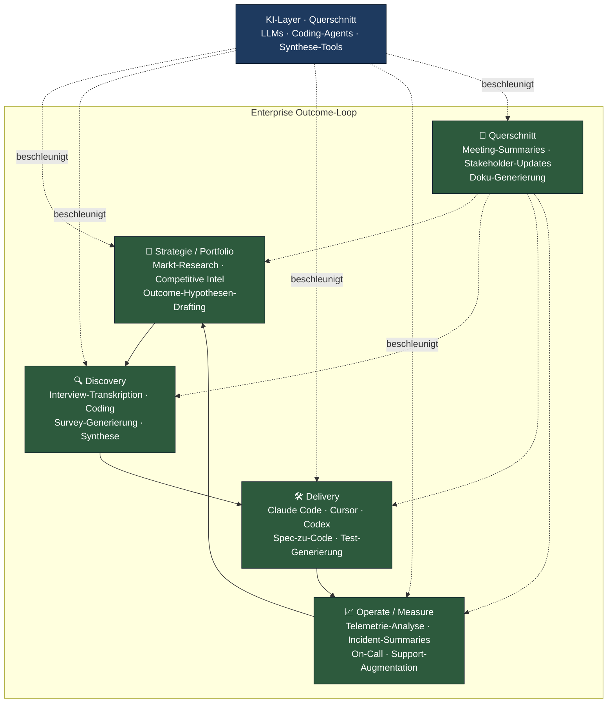
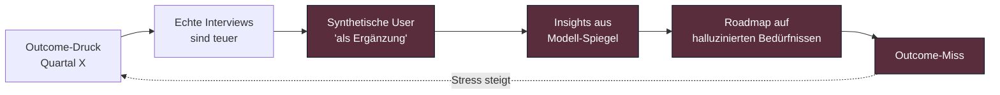
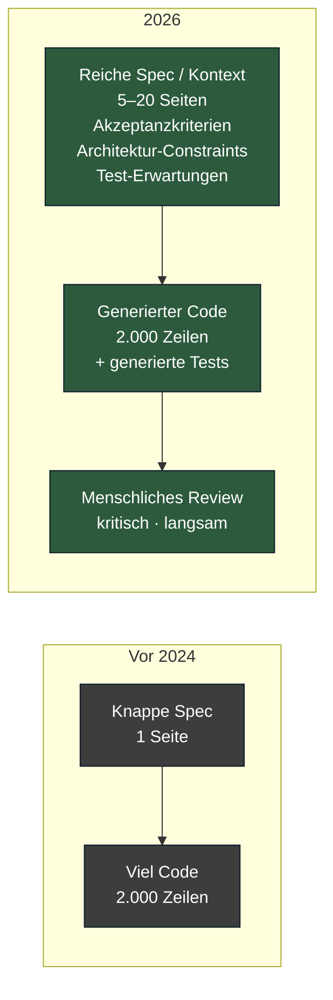
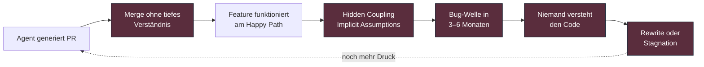
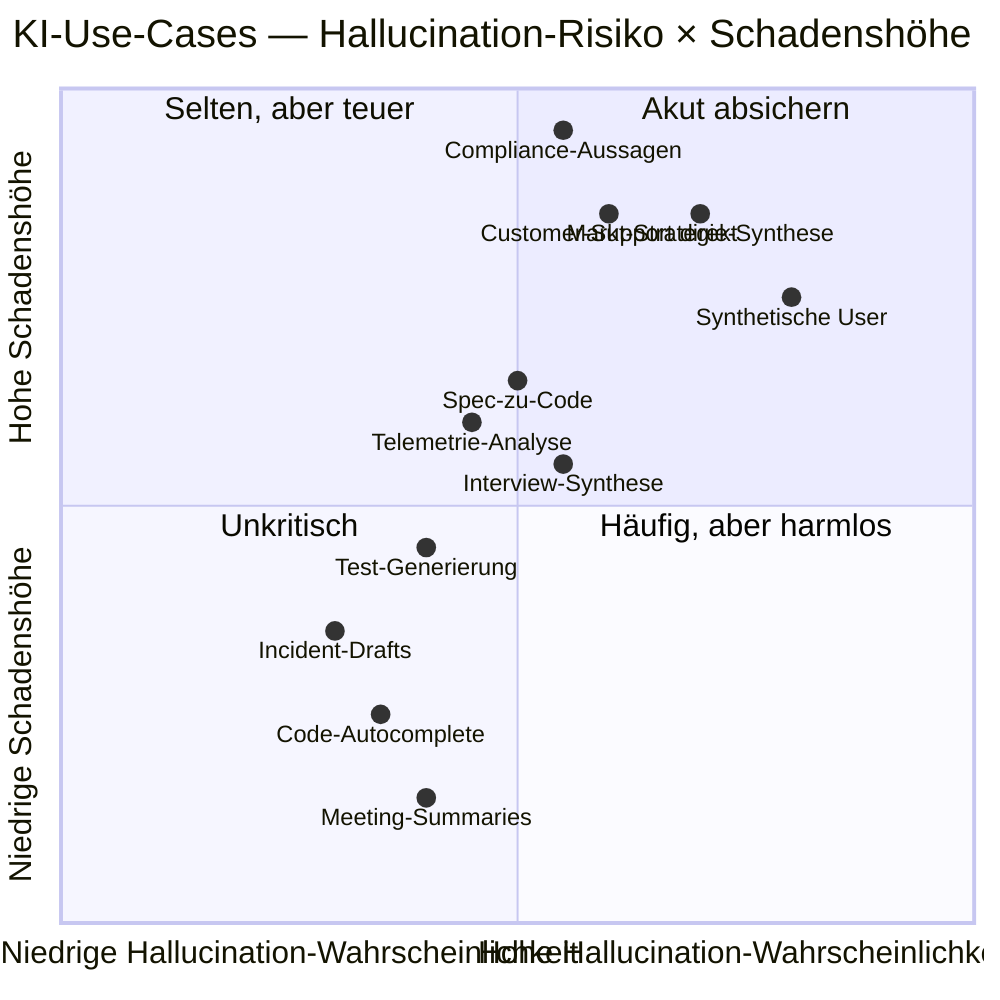

# AI-augmented Product Workflows 2026: was sich gerade ändert

> Wie generative KI den Outcome-Loop beschleunigt — und wo sie still und leise Wert vernichtet.

**Lesezeit: ~12 Min**
**Serie: [Übersicht](index.md) · Teil 5 von 5**

---

In den vier vorigen Teilen dieser Serie haben wir den Stack zusammengebaut, mit dem
Enterprise-500+-Organisationen den Sprung aus dem Skalierungs-Theater hinter SAFe
und LeSS schaffen. Das **Product Operating Model** liefert das Betriebsmodell.
**Outcome-based Roadmapping** liefert die Strategie-Sprache. **Continuous Discovery**
und **Dual-Track Agile** liefern die Lernschleifen. **Team Topologies** liefert das
Org-Design. Verknüpft sind sie im
[Enterprise Outcome-Loop](../cycle/enterprise-outcome-loop.md) — dem Referenzdiagramm,
das den ganzen Stack zusammenhält.

Jetzt, Mitte 2026, hat sich seit den ersten Posts dieser Serie nochmal etwas
verschoben. Die Frage in jedem Steering-Meeting lautet nicht mehr "machen wir
agil oder SAFe?" — sondern "wie nutzen wir KI in unseren Produktteams, ohne
dass die Qualität implodiert?".

Dieser Post ist eine Bestandsaufnahme: was sich konkret ändert, was Hype bleibt,
und welche Anti-Patterns wir in den letzten 18 Monaten bei genug Klienten gesehen
haben, um darüber schreiben zu können.

## Kernthese: AI ist kein neuer Stack, sondern ein Layer über deinem

Die wichtigste Botschaft zuerst, denn sie wird in Vendor-Decks systematisch
verdreht: **Generative KI ist keine eigenständige Methode.** Sie ist auch kein
Operating Model. Sie ersetzt weder POM noch Team Topologies. Sie ist ein
*Querschnitts-Beschleuniger*, der über *allen* Ebenen des Outcome-Loops liegt
und auf jeder Ebene andere Wirkungen entfaltet.

Daraus folgt eine harte, aber wichtige Konsequenz:

> Wenn deine Organisation noch keinen funktionierenden Outcome-Loop hat,
> baut KI dir nur schneller den falschen Mist.

Wer Feature-Factory-Strukturen mit Claude Code beschleunigt, produziert mehr
Features, die keinen Outcome verschieben. Wer ohne echte Discovery synthetische
User-Interviews laufen lässt, generiert Insights, die im Spiegel des eigenen
Modells geboren sind. Wer Strategien aus ChatGPT-Synthese baut, ohne den Markt
zu kennen, kauft Halluzinationen für Beraterhonorare ein.

KI verstärkt, was schon da ist. Bei reifen Organisationen ist das Hebel. Bei
unreifen Organisationen ist es Beschleunigung in die falsche Richtung.

Schauen wir jetzt Schicht für Schicht, was 2026 konkret passiert.

## Strategie und Portfolio: Synthese mit Vorsicht

Auf der obersten Ebene des Loops sind LLMs vor allem **Synthese-Maschinen**.
Sie verdichten Analystenberichte, lesen 200-seitige Branchenstudien, ziehen
Patentanmeldungen zusammen, übersetzen japanische Wettbewerbs-Whitepaper.

Was 2026 in funktionierenden Strategie-Teams passiert:

- **Competitive Intelligence:** Strukturiertes Scraping plus LLM-Synthese ersetzt
  einen Großteil der manuellen Beobachtung. Wer noch eine Praktikantin auf
  Crunchbase ansetzt, hat den Anschluss verloren.
- **Markt-Synthese:** Gartner-, Forrester- und IDC-Reports gehen durch
  Claude-Pipelines mit firmenspezifischen Prompts. Output: strukturierte
  Hypothesen-Listen statt 80-Seiten-PDFs.
- **Outcome-Hypothesen-Drafting:** Statt drei Wochen Workshop liefert das
  Strategie-Team zwölf Hypothesen-Drafts in einer Stunde — und diskutiert
  drei Tage darüber, welche stimmen könnten.

Das Risiko hier ist ungewöhnlich groß und wird unterschätzt: **Halluzination
in Strategie-Kontexten**. Ein LLM, das nicht weiß, dass es etwas nicht weiß,
schreibt überzeugende Sätze über Marktgrößen, Wettbewerber-Pricing oder
regulatorische Veränderungen, die schlicht erfunden sind. Im Code findest
du das in Sekunden, weil Tests fehlschlagen. In einer Strategie merkst du
es zwei Quartale später, wenn die Bets ins Leere laufen.

Praktische Faustregel: KI synthetisiert, Menschen verifizieren Quellen. Jede
Zahl in einem Strategie-Dokument muss eine zitierbare Primärquelle haben.
Nicht *"laut Claude"*. Nicht *"GPT sagt"*. Konkrete URL, konkrete Seite,
konkrete Methodik.

## Discovery: skaliert, aber gefährdet

Die Discovery-Schicht ist die produktivste KI-Spielwiese 2026 — und
gleichzeitig die mit den feinsten ethischen Fallstricken.

Was funktioniert:

- **Interview-Transkription und Coding:** Tools wie Dovetail haben
  KI-Synthese tief integriert. 30 Interviews werden in zwei Stunden
  transkribiert, getaggt und in Themen-Cluster gelegt. Was früher zwei
  Wochen Research-Ops gefressen hat, dauert einen Nachmittag.
- **Survey-Generierung mit Pretest:** Claude oder GPT generieren
  Fragebogen-Varianten, ein Pretest-Lauf mit echten Nutzern (nicht
  synthetischen!) prüft Verständlichkeit.
- **Insight-Verdichtung:** OST-Updates, in denen das LLM aus dem Interview-Corpus
  neue Opportunities vorschlägt — die Trios entscheiden, ob sie haltbar sind.

Was kritisch ist:

- **Synthetische User.** Mehrere Vendor schlagen vor, "User-Interviews" mit
  generierten Personas zu simulieren. Das ist Cagans Lieblings-Hassthema, und
  zu Recht. Ein LLM-Modell einer "35-jährigen Marketing-Managerin aus Hamburg"
  zeigt dir, was das Modell für plausibel hält — also den Durchschnitt seines
  Trainingsdatensatzes. Echte Kunden sind unerwartet, widersprüchlich,
  unbequem. Genau deshalb lernst du von ihnen.

Synthetische User haben einen schmalen legitimen Einsatz: als *Pretest-Werkzeug*
für Interview-Leitfäden, als Sparringspartner für Hypothesen, als Diskussions-Anstoß
im Trio. Sie haben keinen legitimen Einsatz als *Ersatz* für echte Customer
Contacts. Wer das verwechselt, verliert die Grundlage seiner Discovery.

## Delivery: Coding-Agents verändern das Spec-Code-Verhältnis

In der Delivery-Schicht ist die Veränderung am sichtbarsten — und am
heißesten diskutiert. Mid-2026 sind drei Ebenen produktiv im Einsatz:

1. **Autocomplete-Tier:** Cursor, GitHub Copilot, Windsurf. Inline-Vorschläge,
   Refactors, Boilerplate. Wirkung: 10–30 % schneller bei mechanischen Tasks,
   kaum Wirkung bei Architektur-Arbeit. Inzwischen Mainstream.
2. **Agent-Tier:** Claude Code, OpenAI Codex (Reboot 2025), Devin, Replit Agent.
   Ein Engineer beschreibt eine Aufgabe, der Agent öffnet PRs, schreibt Tests,
   iteriert über CI-Feedback. Wirkung: bei gut strukturierten Codebases mit
   guter Test-Abdeckung dramatisch (Faktor 2–5 bei klar abgrenzbaren Tasks).
   Bei Legacy-Mono-Repos überschaubar.
3. **Spec-zu-Code-Tier:** Aus einem strukturierten Discovery-Artefakt (etwa
   einem ausgereiften OST-Knoten plus Acceptance-Kriterien) generieren Agents
   einen ersten PR. Engineer-Review wird zur Hauptarbeit, nicht das Tippen.

Das verschiebt das **Verhältnis von Spec zu Code** spürbar:

Was hier kippt: Engineering-Zeit wandert von *Tippen* zu *Spezifizieren* und
*Reviewen*. Die wertvollste Person im Team ist nicht mehr die mit der schnellsten
Tastatur, sondern die mit dem klarsten Kopf für Architektur, Edge-Cases und
gute Tests. Junior-Engineers, die nur noch Agents bedienen, ohne die generierten
Diffs zu verstehen, bauen ein gefährliches Skill-Loch.

Das führt zum **Vibe-Coding-Anti-Pattern**: schnell akzeptierte Diffs, oberflächliches
Review, Tech-Debt-Akkumulation, irgendwann Stillstand:

Das Gegenmittel ist nicht "weniger KI". Das Gegenmittel ist
**Engineering-Hygiene als Hartanforderung**: Tests vor Merge, Architecture
Decision Records, Pair-Review für agent-generierten Code, regelmäßige
Refactoring-Quoten, Onboarding-Pfade, die das Verstehen vor das Generieren
stellen.

## Operate und Measure: stiller Mehrwert

Auf der Operate-Ebene wird oft am wenigsten gesprochen — und am meisten
geliefert. Hier sind 2026 die ruhigsten und stabilsten KI-Wins:

- **Telemetrie-Analyse:** "Warum ist die Conversion in Cohort X eingebrochen?"
  ist eine Frage, die LLM-Tools über Tracing-Daten überraschend gut beantworten —
  vorausgesetzt, deine Telemetrie ist sauber strukturiert.
- **Incident-Summaries:** Postmortems schreiben sich nicht selbst, aber der
  erste Draft (Timeline, betroffene Services, Impact-Schätzung) kommt aus
  einem Agent über Log-Pipeline. Senior-SREs editieren statt zu tippen.
- **On-Call-Assistance:** Runbook-Suche und Symptom-Klassifikation durch
  Agents, die Code, Docs und vergangene Incidents kennen. Reduziert MTTR
  in reifen Organisationen messbar.
- **Customer-Support-Augmentation:** Erste-Level-Support wird Hybrid:
  Agent schlägt vor, Mensch entscheidet. Bei klarem Hand-off und sauberer
  Eskalation eine der besten KI-Wertschöpfungen 2026.

Was hier zählt: **Datenhygiene**. KI auf chaotische Logs ist Kaffeesatz mit
mehr Selbstvertrauen. KI auf strukturierte, gelabelte Telemetrie ist ein
ernsthafter Force-Multiplier.

## Querschnitt: das unspektakuläre Drittel

Meetings, Updates, Doku — die unglamouröse Arbeit, die in jeder
Produktorganisation 30 % der Wochenzeit frisst. Hier ist KI 2026 schlicht
*Default*. Wer ein Team führt und keine automatischen Meeting-Summaries,
Stakeholder-Update-Drafts und Doku-Generierung im Workflow hat, verbrennt
Geld. Tools sind hier Commodity (Otter, Granola, Fireflies, plus jede
LLM-Konsole), die Frage ist nicht *ob*, sondern *wie sauber integriert*.

Ein Hinweis aus der Praxis: KI-generierte Updates haben einen erkennbaren
Stil. Wenn jede Wochenkommunikation gleich klingt, sinkt Aufmerksamkeit.
Setze einen Bearbeitungsschritt zwischen Generierung und Versand. Sonst
kannst du es dir auch sparen.

## Governance: was Enterprise 500+ jetzt nicht mehr aufschieben kann

Für 500+-Organisationen ist 2026 das Jahr, in dem die Governance-Themen
nicht mehr ignoriert werden können. Die Hochrisiko-Bestimmungen des
**EU AI Act** sind seit August 2026 vollständig anwendbar; Hochrisiko-
Systeme nach Annex III brauchen seither ein dokumentiertes Risk-Management-
System, Konformitätsbewertung und CE-Kennzeichnung. Generative-AI-Systeme
unterliegen seit August 2025 schon Transparenz- und Trainingsdaten-Pflichten.

Konkrete Themen, die jede Produktorganisation 500+ bis Ende 2026 geklärt
haben sollte:

- **Modell-Auswahl und Datenhoheit.** Cloud-Modelle (Anthropic via AWS Bedrock,
  Azure OpenAI, Vertex) oder lokale Modelle (Llama-Familie, Mistral, Qwen)?
  Was darf an US-/CN-Anbieter, was bleibt in der EU, was bleibt on-prem?
  Schrems-II-relevante Datenströme sind weiterhin ein Thema.
- **PII und IP.** Welche Daten dürfen in welches Modell? Wie verhindern wir,
  dass Kundendaten in Training landen? Welche Verträge mit Vendor-Modellen
  garantieren das (No-Training-Clauses, Audit-Rechte)?
- **Audit-Trails.** Welcher Prompt hat welchen Output erzeugt, in welcher
  Modell-Version, mit welchem Kontext? Für Hochrisiko-Anwendungen Pflicht,
  für alles andere gute Praxis.
- **Skill-Erhalt vs. Skill-Atrophie.** Wie stellen wir sicher, dass unsere
  Engineers in fünf Jahren noch ohne Agent debuggen können? Wie sieht eine
  Karriereentwicklung aus, wenn die ersten drei Jahre weniger Tipparbeit
  bedeuten?

Eine Risikoeinschätzung pro Use-Case lohnt sich — Hallucination-Wahrscheinlichkeit
gegen Schadenshöhe:

Die obere rechte Ecke ist die, in der du *keinen* unkontrollierten Agent
laufen lassen willst. Die untere linke Ecke ist die, in der jede manuelle
Reibung verschwendet ist.

## Neue Rollen, die wir 2026 sehen

Drei Rollen kristallisieren sich gerade heraus, mit unterschiedlicher
Reife:

- **AI Product Engineer.** Engineer, die nicht *KI-Modelle entwickeln*,
  sondern *Produkte mit KI bauen*. Verstehen Prompt-Engineering, Eval-Loops,
  RAG-Architekturen, Halluzinations-Mitigations. Auf den Stellenmärkten
  2026 die heißeste Position.
- **Prompt / Context Engineer.** Umstrittener Begriff, aber realistische
  Funktion: Person, die für Produkt-spezifische Workflows Prompts, Tool-
  Definitionen, Kontext-Pipelines und Eval-Suites pflegt. Häufig bei
  PM oder Tech-Lead angesiedelt, nicht eigene Rolle. Wahrscheinlich
  in 2–3 Jahren wieder absorbiert.
- **AI Governance Officer / AI Risk Lead.** In regulierten Branchen
  (Finanz, Health, Versicherung, öffentlicher Sektor) bereits etabliert.
  Schnittstelle zwischen Legal, Security, Compliance und Produkt.
  Nicht optional in Enterprise 500+.

Was *nicht* entsteht — entgegen 2024er Hype — ist eine eigenständige
"AI Product Manager"-Rolle, die parallel zum normalen PM existiert. KI
ist Werkzeug; *jeder* PM muss damit umgehen können. Eine Spezialrolle
"AI-PM" ist ein vorübergehendes Übergangsphänomen, kein Endzustand.

## Was sich *nicht* ändert

Beim ganzen KI-Lärm geht eine Wahrheit unter, die in dieser Serie zentral
ist: **die menschlichen und strukturellen Anforderungen guter Produktarbeit
sind dieselben geblieben.**

- **Empowered Teams** brauchen Vertrauen, Outcomes und Kontext. KI ersetzt
  weder Vertrauen noch Sinn.
- **Outcome-Steuerung** schlägt Output-Steuerung. KI erzeugt mehr Output —
  das ist ein Trigger, *strenger* auf Outcomes zu steuern, nicht lockerer.
- **Echte Kundenkontakte** sind durch nichts ersetzbar. Synthese aus
  bestehenden Daten ist Verdichtung, keine neue Information.
- **Langlebige Teams.** Wissen über Kunden, Code, System-Quirks akkumuliert
  in Menschen, nicht in Prompts. Teamfluktuation bleibt der teuerste
  Effizienzverlust.
- **Engineering-Hygiene.** Tests, Refactoring, Architecture-Reviews,
  Pairing — alles wichtiger geworden, nicht weniger.
- **Discovery-Praxis.** Continuous Discovery braucht echte Stimmen.
  Daran ändert keine Modellversion etwas.

Wer den Outcome-Loop aus den ersten vier Teilen dieser Serie ernst nimmt,
hat das robuste Fundament, auf dem KI-Hebel wirken können. Wer ihn nicht
hat, baut auf Sand — nur jetzt mit Bagger.

## Praktischer Einstieg für 2026

Wenn du heute in einer 500+-Org sitzt und nicht weißt, wo du beginnen
sollst, ist die Reihenfolge nicht zufällig. Sie folgt dem Outcome-Loop
von außen nach innen:

1. **Querschnitt zuerst.** Meeting-Summaries, Doku-Generierung,
   Stakeholder-Updates. Niedriges Risiko, schnelles Lernen über
   Datenflüsse und Vendor-Verträge.
2. **Operate.** Telemetrie-Analyse, Incident-Drafts, Runbook-Suche.
   Klare ROI-Signale, technisch saubere Datenquellen.
3. **Delivery.** Coding-Agents in *einem* Pilot-Team mit
   überdurchschnittlicher Engineering-Reife — nicht im Legacy-Mono-Repo.
   Lernen über Spec-Disziplin und Review-Praxis.
4. **Discovery.** Transkription, Coding, Synthese. *Echte* Interviews
   bleiben Pflicht.
5. **Strategie zuletzt.** Synthese und Drafting — niemals Entscheidungen.
   Hier ist das Risiko-Schadens-Produkt am höchsten.

Parallel: Governance-Track aufsetzen, Modell-Inventar führen, EU-AI-Act-
Konformität ableiten, Skill-Pfade für Engineers definieren. Das ist
keine Zusatzarbeit — das ist die Voraussetzung dafür, dass die obige
Reihenfolge nicht in einer Compliance-Krise endet.

## Schlusswort der Serie

Vom **POM** als Operating Model (Teil 2) über **Outcomes statt Outputs**
(Teil 3) zu **Team Topologies plus POM** (Teil 4) und jetzt zur
**KI-Beschleunigung dieses Stacks** schließt sich der Bogen. Der
Enterprise Outcome-Loop ist 2026 vollständiger denn je: er beschreibt
nicht nur, wie Produktorganisationen lernen sollten — er beschreibt auch,
wo KI Hebel ist und wo sie Risiko ist.

Was wir in den nächsten 12 Monaten erwarten: weitere Verschiebung
Richtung Spec-zu-Code, ernsthafte EU-AI-Act-Audit-Welle in
Hochrisiko-Branchen, Konsolidierung der Coding-Agent-Landschaft,
und — wahrscheinlich — die erste Welle prominenter
Vibe-Coding-Disaster, die als Warnung in die Branche gehen.

Wer den Stack aus dieser Serie bis dahin verinnerlicht hat — Outcomes,
Discovery, Empowered Teams, Team Topologies, saubere Engineering-
Praktiken — ist nicht nur KI-bereit. Er ist *Veränderungs-bereit*. Und
genau das war seit Teil 1 der eigentliche Punkt.

---

## Quellen

- Anthropic Engineering Blog (claude.com/engineering) — Coding-Agent-Patterns, Eval-Praxis
- OpenAI Codex Documentation (platform.openai.com) — Agent-API und Tool-Use
- Cursor Docs (docs.cursor.com) — IDE-Integration und Context-Windows
- Lenny Rachitsky: *Lenny's Newsletter* — laufende Praxis-Berichte 2024–2026
- Marty Cagan / SVPG: "AI and the Product Operating Model" (svpg.com, 2024) und Folgeartikel
- Nielsen Norman Group: AI-UX-Research (nngroup.com) — kritisch zu synthetischen Usern
- EU AI Act, Verordnung (EU) 2024/1689 — Risk Tiers, Hochrisiko-Anwendungen, Anwendungsfristen
- Repo-Quelle: [AI-augmented Workflows](../methods/modern/ai-augmented-workflows.md)
- Repo-Quelle: [Enterprise Outcome-Loop](../cycle/enterprise-outcome-loop.md)
- Repo-Quelle: [Vergleichsmatrix](../comparison/matrix.md)

---

← Vorheriger Teil: [Topologies + POM](04-team-topologies-pom.md)

Ende der Serie · zurück zur [Übersicht](index.md) · Vertiefung in den [Methoden-Profilen](../methods/00-overview.md)
