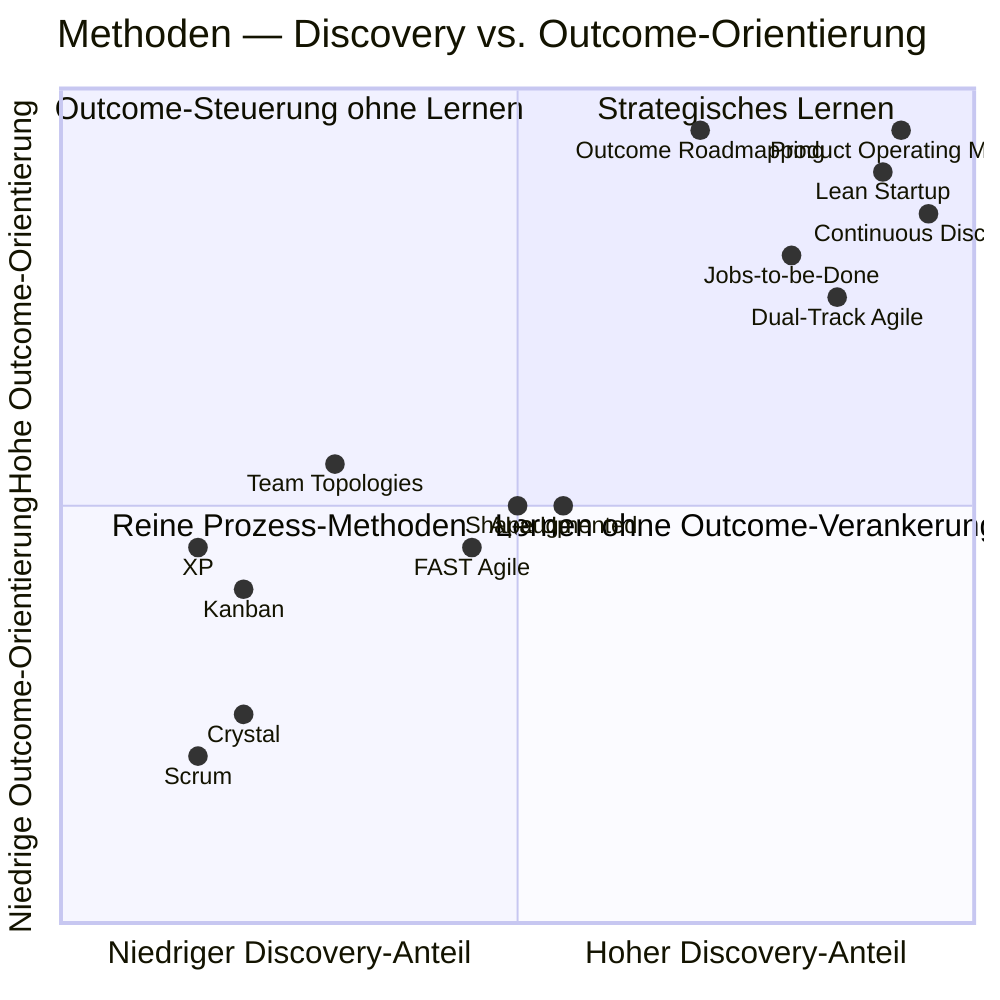

# Vergleichsmatrix

Sieben Achsen über alle 14 Methoden hinweg. Ratings sind *einordnend*,
keine harten Benchmarks — sie helfen, Komplementaritäten und
Anti-Pattern-Kombinationen sichtbar zu machen.

## Achsen

- **Primärer Hebel** — wo greift die Methode an? (Prozess · Engineering · Discovery · Org-Design · Strategie · Querschnitt)
- **Kadenz** — kürzester eingebauter Lern-Zyklus
- **Discovery-Anteil** — wieviel Lernen vor dem Bauen?
- **Outcome-Orientierung** — misst sie Wirkung oder Output?
- **Team-Autonomie** — wie viel Entscheidung beim Team?
- **Enterprise-Eignung (500+)** — funktioniert sie bei dieser Größe?
- **Verträglich mit Outcome-Loop** — passt sie ins Hauptdiagramm?

Skala: ◔ niedrig · ◑ mittel · ◕ hoch · ● sehr hoch · — n/a

## Cluster A — Klassisch

| Methode | Hebel       | Kadenz     | Discovery | Outcome | Autonomie | Ent. 500+ | Outcome-Loop |
|---------|-------------|------------|-----------|---------|-----------|-----------|--------------|
| Scrum   | Prozess     | 1–4 Wochen | ◔         | ◔       | ◑         | ◑         | Bedingt      |
| Kanban  | Prozess     | Continuous | ◔         | ◑       | ◑         | ●         | Ja           |
| XP      | Engineering | Continuous | ◔         | ◑       | ◕         | ◕ (Praktiken) | Ja       |
| Crystal | Org-Design  | flexibel   | ◔         | ◔       | ◕         | ◔         | Bedingt      |

## Cluster B — Discovery / Produkt-orientiert

| Methode               | Hebel     | Kadenz     | Discovery | Outcome | Autonomie | Ent. 500+ | Outcome-Loop |
|-----------------------|-----------|------------|-----------|---------|-----------|-----------|--------------|
| Shape Up              | Prozess   | 6+2 Wochen | ◑         | ◑       | ●         | ◑         | Ja           |
| Dual-Track Agile      | Discovery | wöchentlich | ●        | ◕       | ◕         | ●         | Ja (zentral) |
| Continuous Discovery  | Discovery | wöchentlich | ●        | ●       | ◕         | ◕         | Ja (zentral) |
| Lean Startup          | Strategie | tage-wochen | ●        | ●       | ◕         | ◕ (für 0→1) | Ja (Bets) |
| Jobs-to-be-Done       | Strategie | strategisch | ◕        | ◕       | ◑         | ●         | Ja (Strategie) |

## Cluster C — Modern / Trend

| Methode                   | Hebel        | Kadenz       | Discovery | Outcome | Autonomie | Ent. 500+ | Outcome-Loop |
|---------------------------|--------------|--------------|-----------|---------|-----------|-----------|--------------|
| Team Topologies           | Org-Design   | quartalsweise | —        | ◑       | ◕         | ●         | Ja (Portfolio) |
| FAST Agile                | Org-Design   | 1–2 Tage     | ◑         | ◑       | ●         | ◔         | Bedingt      |
| Outcome-based Roadmapping | Strategie    | quartalsweise | ◕        | ●       | ◑         | ●         | Ja (Portfolio) |
| Product Operating Model   | Operating Model | mehrschichtig | ●     | ●       | ●         | ●         | Ja (verkörpert) |
| AI-augmented Workflows    | Querschnitt  | continuous   | ◑         | ◑       | —         | ◕         | Ja (Layer)   |

## Quadranten-Visualisierung

Discovery-Anteil × Outcome-Orientierung — wo positionieren sich die Methoden?

## Lesart der Matrix

**Was die Verteilung zeigt:**

1. **Klassische Methoden (A)** clustern unten-links: hohe Prozess-Disziplin,
   wenig Discovery, wenig Outcome-Verankerung. Notwendig, aber nicht
   hinreichend für moderne Produktorgs.
2. **Discovery-Methoden (B)** clustern oben-rechts: stark in Lernen und
   Outcome-Sprache. Brauchen aber eine Delivery-Engine (A) und ein
   Org-Design (C) als Träger.
3. **Modernes Cluster (C)** ist heterogen — POM und Outcome-Roadmapping
   verankern Outcomes, Team Topologies adressiert Struktur,
   AI-augmented ist Querschnitt.

**Kombinations-Empfehlung für Enterprise 500+:**

- POM als Operating Model
- Team Topologies als Org-Design
- Continuous Discovery + Dual-Track + JTBD als Discovery-Praxis
- Kanban (Platform) + Scrum oder Shape Up (Stream-Teams) als Delivery
- XP-Engineering-Praktiken als Fundament
- Outcome-Roadmapping als Strategie-Sprache
- AI-augmented Workflows als Beschleuniger über allem

→ Ergibt den [Enterprise Outcome-Loop](../cycle/enterprise-outcome-loop.md).
