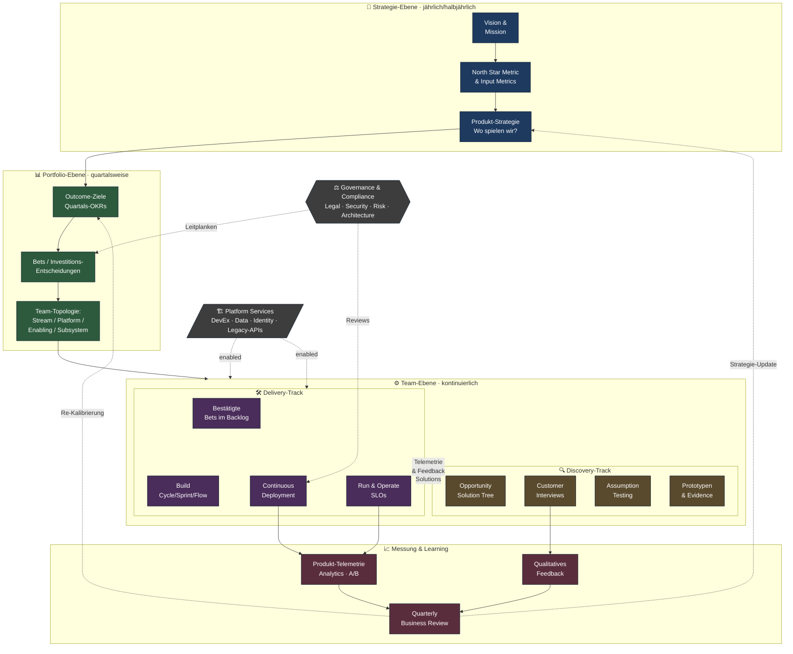
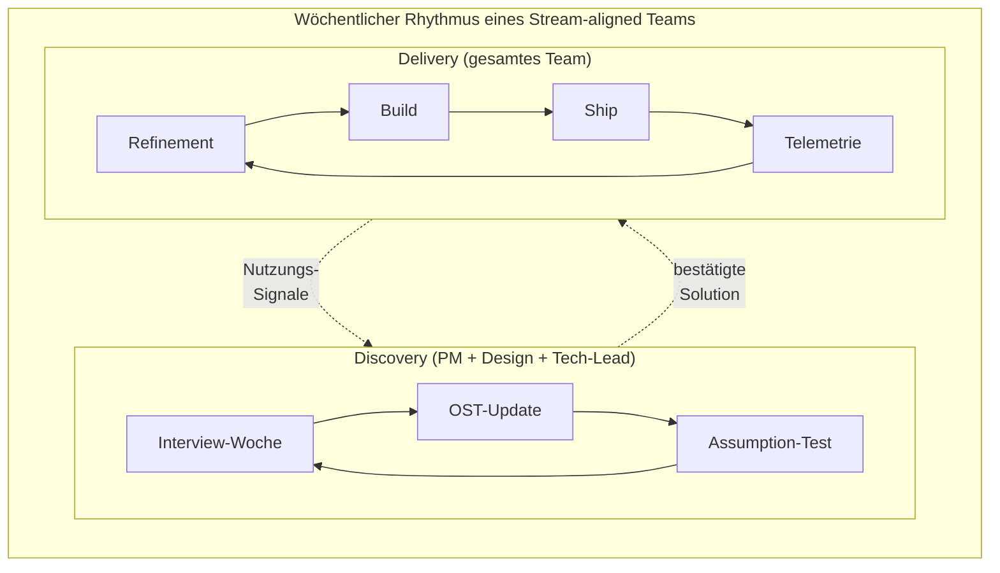
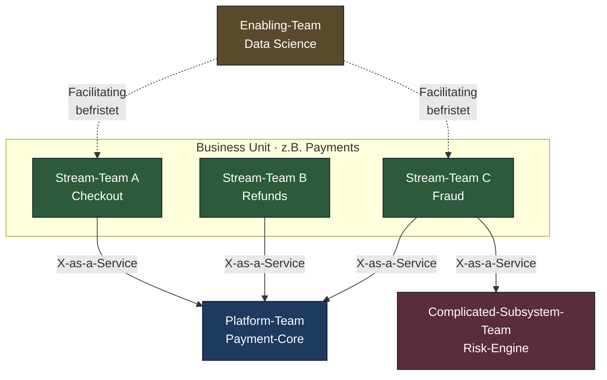

# Enterprise Outcome-Loop

Referenz-Zyklus für agile Produktentwicklung in komplexen Organisationen
(500+ Personen, Multi-BU, Compliance, Legacy). Der Loop versteht
Produktentwicklung als **kontinuierlichen Lern-Kreislauf** — nicht als
linearen Prozess von Idee zu Release.

## Leitprinzipien

1. **Outcomes statt Outputs** — gemessen wird Wirkung, nicht Feature-Anzahl.
2. **Discovery und Delivery laufen parallel**, nicht sequenziell.
3. **Strategie wird quartalsweise neu kalibriert**, nicht jährlich eingefroren.
4. **Teams sind langlebig und stream-aligned**, nicht projektgebunden.
5. **Plattform-Teams enablen, Stream-Teams liefern**, Governance moderiert.

---

## Hauptdiagramm: End-to-End Outcome-Loop

---

## Zoom 1: Dual-Track innerhalb eines Stream-Teams

---

## Zoom 2: Team-Topologien-Interaktion

---

## Lesart der Schleifen

| Schleife              | Kadenz             | Was wird gelernt                          |
|-----------------------|--------------------|-------------------------------------------|
| Strategie ↻ Review    | quartalsweise      | Spielen wir noch auf dem richtigen Feld?  |
| Outcomes ↻ Bets       | quartalsweise      | Wirken unsere Investitionen?              |
| Discovery ↻ Delivery  | wöchentlich        | Stimmt unsere Lösungs-Hypothese?          |
| Build ↻ Telemetrie    | täglich/continuous | Funktioniert das Feature in echt?         |
| Interview ↻ OST       | wöchentlich        | Verstehen wir das Kunden-Problem richtig? |

## Was dieser Loop *nicht* ist

- **Kein Phasenmodell** — alle Bereiche laufen kontinuierlich parallel.
- **Kein Skalierungs-Framework** — keine fixen Synchronisations-Events
  wie SAFe PI-Planning. Sync entsteht durch geteilte Outcomes, nicht durch Kalender.
- **Kein Top-Down** — Strategie setzt Leitplanken, Teams entscheiden Solutions.

## Quellen / Inspiration

- Marty Cagan: *Inspired*, *Empowered*, *Transformed* (Product Operating Model)
- Teresa Torres: *Continuous Discovery Habits* (Opportunity Solution Tree)
- Skelton & Pais: *Team Topologies*
- Christina Wodtke: *Radical Focus* (OKRs)
- Melissa Perri: *Escaping the Build Trap*
