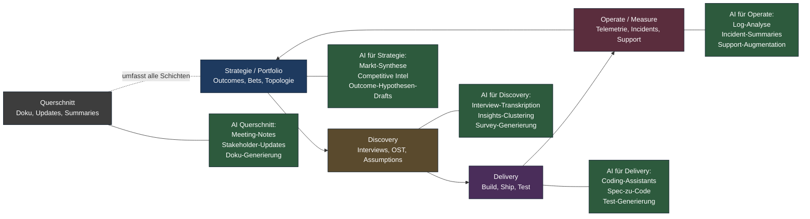
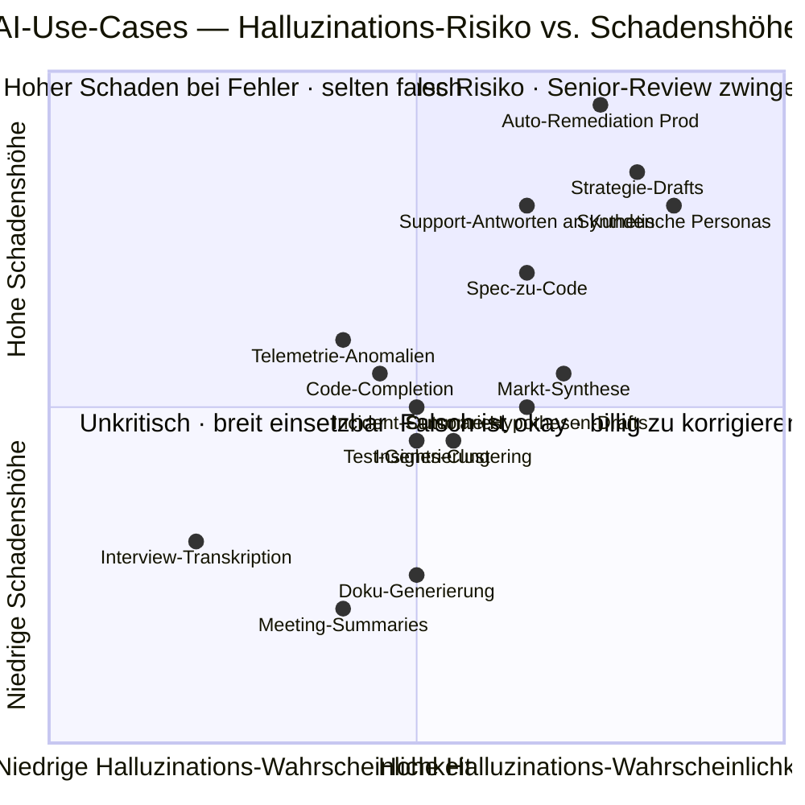

# AI-Tooling-Map per Loop-Phase

Stand: Mai 2026. Welche AI-Tools landen in welcher Schicht des
[Enterprise Outcome-Loop](../cycle/enterprise-outcome-loop.md)? Diese
Map ist eine pragmatische Bestandsaufnahme — keine Empfehlung pro Tool,
sondern eine Orientierung, *wo* generative KI heute realen Hebel hat
und *wo* sie überproportional Schaden anrichten kann.

Methodischer Rahmen siehe [AI-augmented Workflows](../methods/modern/ai-augmented-workflows.md).
Tools werden namentlich genannt, weil 2026 die Auswahl stabil genug
geworden ist, um sie zu fixieren — der Markt konsolidiert auf wenige
Anbieter pro Use-Case.

---

## Hauptdiagramm: AI-Annotationen pro Loop-Schicht

Die AI-Boxen liegen *neben* den Loop-Schichten, nicht in ihnen. Das ist
absichtlich: AI ergänzt jede Schicht, ersetzt aber keine. Die
[Cagan-Kritik an synthetischen Nutzern](../methods/modern/ai-augmented-workflows.md#schwächen--anti-patterns)
gilt analog für jede Schicht — AI-Output ist immer Hypothese, nie
Evidence.

---

## Schicht 1: Strategie / Portfolio

**Use-Cases:**

- **Markt-Synthese:** Research-Reports zusammenfassen, Wettbewerbs-Landkarten
  bauen (Claude, ChatGPT, Perplexity).
- **Outcome-Hypothesen-Drafting:** Aus Telemetrie + qualitativem Feedback
  Kandidaten-Outcomes generieren, die das Trio dann schärft.
- **Competitive Intelligence:** Anbieter-Vergleiche, Pricing-Recherche,
  Funktionsabdeckungen. Stand-Hold ist Wochen, nicht Tage — Modelle sehen
  alte Daten.
- **Strategie-Stress-Tests:** Devil's-Advocate-Prompts gegen eine
  bestehende Strategie, "Was übersehen wir?".

**Tools:** Claude Opus/Sonnet 4.x, ChatGPT-5, Gemini 2.5, Perplexity
(für aktuelle Quellen), spezialisierte Research-Tools wie Glasp und
NotebookLM.

**Was *nicht* funktioniert:** AI als alleinige Strategie-Quelle. Modelle
glätten zu Mainstream, sie generieren konsensual, nicht
kontra-intuitiv — und genau Kontra-Intuition ist Strategie.

---

## Schicht 2: Discovery

**Use-Cases:**

- **Interview-Transkription + Synthese:** Dovetail mit eingebauter
  AI-Synthese, alternativ Claude/ChatGPT auf rohem Transkript. Themen-
  Clustering, Zitat-Extraktion.
- **Survey-Generierung:** Erste Frage-Drafts aus Outcome-Hypothesen, dann
  manuell schärfen.
- **Opportunity-Solution-Tree-Pflege:** Modelle helfen bei
  Re-Organisation größerer Trees, schlagen fehlende Sub-Opportunities vor.
- **Synthetische Personas** (mit Vorsicht): als Hypothesen-Generator
  brauchbar, als Validation gefährlich. Cagans Kritik gilt.

**Tools:** Dovetail (Research-Plattform), Claude, ChatGPT, Notion AI,
EnjoyHQ (kleiner Player).

**Was *nicht* funktioniert:** Echte Kunden ersetzen. Discovery-Reife
zeigt sich daran, wie oft pro Woche das Trio *mit echten Menschen* spricht.
AI macht das Aufbereiten schneller, nicht das Sprechen.

---

## Schicht 3: Delivery

**Use-Cases:**

- **Coding-Assistants im IDE:** Cursor (Editor-first), Claude Code (CLI-first),
  GitHub Copilot, OpenAI Codex. Inline-Completion, Multi-File-Edits,
  Codebase-Q&A.
- **Agent-basierte Tasks:** Claude Code im Agent-Modus, Devin (Cognition),
  Replit Agent. Aufgaben in Tickets formuliert, Agent öffnet PR.
- **Spec-zu-Code:** PRDs und ADRs als Kontext, generierte Skelette,
  manuelle Verfeinerung. Funktioniert gut für Boilerplate, riskant für
  Geschäftslogik.
- **Test-Generierung:** Unit-Tests aus Funktions-Signatur, Property-based
  Test-Vorschläge. Pflicht-Review.
- **Code-Review-Assistance:** Erste Runde durch Modell (Style, naive Bugs),
  Senior-Review danach. Nicht umgekehrt.

**Tools:** Claude Code, Cursor, GitHub Copilot, OpenAI Codex, Devin,
Replit Agent, JetBrains AI. Spezialisten: Tabby, Cody, Continue
(self-hosted).

**Was *nicht* funktioniert:** "Vibe Coding" für Production-Code. Senior-
Engineering bleibt notwendig. Wer ohne Domain-Verständnis generiert,
baut technical-debt-Halden, die in 12 Monaten teuer werden.

---

## Schicht 4: Operate / Measure

**Use-Cases:**

- **Telemetrie-Analyse:** Anomaly-Detection auf Metriken,
  Cohort-Vergleiche, automatische Insight-Generierung aus Dashboards.
- **Incident-Summaries:** Aus Logs + Slack-Threads ein Post-Mortem-Draft.
  Senior-Review zwingend.
- **Customer-Support-Augmentation:** Draft-Antworten für Support-Tickets,
  Routing-Vorschläge, Trend-Erkennung in Support-Volumen.
- **On-Call-Assistance:** Runbook-Suche, Diagnose-Vorschläge bei
  Alarmen. Nie autonom handeln lassen.

**Tools:** Datadog AI, New Relic AI, Honeycomb (BubbleUp),
Intercom Fin, Zendesk AI, Sentry AI. Querschnitt: Claude/ChatGPT für
Ad-hoc-Analysen.

**Was *nicht* funktioniert:** Modell-getriebene Auto-Remediation in
Production. Hallucination + Production = Outage.

---

## Schicht 5: Querschnitt

**Use-Cases:**

- **Meeting-Summaries:** Otter, Granola, tl;dv, Read.ai, eingebaute
  Funktionen in Zoom/Teams/Meet. Stakeholder-relevante Zusammenfassungen.
- **Stakeholder-Updates:** Aus Confluence/Notion-Inhalten Wochen-Briefs
  generieren. Personalisiert pro Empfänger.
- **Doku-Generierung:** API-Doku aus Code, ADRs aus Commit-Historie,
  Onboarding-Material aus internen Wikis.
- **Internes Knowledge-Q&A:** Glean, Notion AI, Coda AI über
  unternehmenseigene Korpora.

**Tools:** Granola, Otter, tl;dv (Meetings), Glean, Notion AI (Search +
Synthese), Coda AI.

---

## Diagramm 2: Risiko-Matrix der wichtigsten Use-Cases

Halluzination-Wahrscheinlichkeit × Schadenshöhe wenn falsch eingesetzt.
Use-Cases im oberen-rechten Quadranten brauchen *zwingend* Senior-Review
vor jedem Einsatz.

Die Verteilung zeigt: **Querschnitts-Use-Cases** (Meetings, Doku) sind
unkritisch und sollten breit ausgerollt werden. **Discovery- und
Delivery-Use-Cases** sind mittleres Risiko, brauchen Review-Disziplin.
**Strategie und Production-Operate** sind die heißen Quadranten —
Strategie-Drafts und Auto-Remediation sind die zwei Themen, an denen
sich AI-Reife einer Org wirklich messen lässt.

---

## Lesart der Map

Drei Schlüsse für die Praxis:

1. **Querschnitt zuerst ausrollen.** Meeting-Notes, Doku, interne Suche.
   Hoher Hebel, niedriges Risiko, baut Vertrauen.
2. **Delivery zweitens.** Coding-Assistants sind 2026 Standard.
   Engineering-Org, die sie nicht hat, verliert Talent. Aber: mit
   Review-Disziplin, nicht als "Vibe Coding".
3. **Strategie und Production-Operate vorsichtig.** Hier ist
   AI-Output *immer* Hypothese. Senior-Hand muss am Hebel bleiben.

Wer die Map mit dem [Maturity-Modell](maturity-modell.md) kreuzt: AI
beschleunigt jede Stufe, hebt aber keine Org auf eine höhere Stufe. Eine
Stufe-2-Org mit Claude Code wird zur *schnelleren* Stufe-2-Org —
nicht zur Stufe-5-Org. Operating-Model-Reife geht der Tool-Adoption
voraus, nicht umgekehrt.
