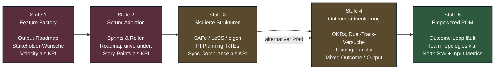
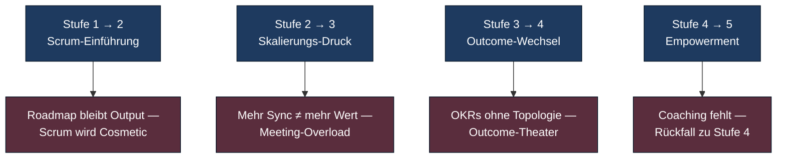

# Product-Org-Maturity-Modell

Fünf Stufen einer Produktorganisation — von der reinen Feature Factory
bis zum Empowered Product Operating Model. Keine Reifegrad-Skala im
CMMI-Sinn, sondern eine Diagnose-Heuristik: *Wo steht eine Org gerade,
und woran erkennst du das?*

Lies das Modell deskriptiv. Stufe 5 ist kein moralisches Ziel, sondern
der Punkt, an dem der [Enterprise Outcome-Loop](../cycle/enterprise-outcome-loop.md)
tatsächlich rund läuft. Viele profitable Firmen leben dauerhaft auf
Stufe 2 oder 3 — die Frage ist nur, was das *kostet*.

---

## Hauptdiagramm: Fünf-Stufen-Progression

Der gestrichelte Pfeil von Stufe 3 zu Stufe 4 deutet an: nicht jede Org
geht über skalierte Frameworks. Manche springen aus Stufe 2 direkt in
Outcome-Orientierung — oft schmerzhaft, aber sauberer.

---

## Stufe 1 — Feature Factory

**Steuerung:** Top-down, Output-Roadmap mit Quartalsterminen.
Ideen kommen aus Vertrieb, Management oder Großkunden-Eskalationen.
Gemessen wird Lieferung: *Wie viele Features pro Quartal?*
Discovery existiert nicht — Anforderungen kommen als "fertig gedachte"
Lösungen ins Team. Der PM ist effektiv Ticket-Übersetzer.

**Typische Methoden:** keine Produktmethoden im engeren Sinne. Wenn
formalisiert, dann minimaler [Scrum](../methods/classical/scrum.md) oder
Wasserfall mit Sprint-Cosmetic.

**Anti-Pattern:** Roadmap = Backlog = Versprechen an Stakeholder.
"Wir können nicht messen, ob das wirkt" gilt als Tugend ("liefern, nicht
diskutieren"). Customer Calls passieren nur durch Sales, nicht durch das
Team.

**Outcome-Loop:** nicht instanziert. Es gibt eine einzige Pipeline
(Input → Build → Ship), keine Lern-Schleife.

---

## Stufe 2 — Scrum-Adoption

**Steuerung:** Sprints, Standups, Retros — die Ceremonies sind etabliert.
Die Roadmap dahinter ist aber unverändert: weiterhin Output, weiterhin
Stakeholder-getrieben. Gemessen wird Velocity. PMs füllen das Backlog,
das von oben kommt.

**Typische Methoden:**
[Scrum](../methods/classical/scrum.md),
[Kanban](../methods/classical/kanban.md) (oft als "Wir machen ScrumBan"),
gelegentlich [XP](../methods/classical/xp.md)-Praktiken (Pair, TDD) auf
Team-Initiative.

**Anti-Pattern:** "Scrum aber" — Sprint-Goal ist eine Liste von Tickets.
Retros adressieren Prozess-Hygiene, nie Produkt-Annahmen.
Story-Points werden zum Performance-KPI ("dieses Team liefert mehr").
Discovery findet — wenn überhaupt — als "Spike" vor dem Sprint statt,
nicht parallel.

**Outcome-Loop:** Discovery-Track fehlt vollständig. Telemetrie wird
oft erfasst, aber nicht in Discovery zurückgespielt — sie landet im
Quarterly Business Review als Vanity-Slide.

---

## Stufe 3 — Skalierte Strukturen

**Steuerung:** Die Org ist auf 200+ Engineers gewachsen, Koordination
wird zur Hauptkraft. Eingeführt wird [SAFe](https://scaledagileframework.com),
LeSS oder eine Eigenentwicklung. PI-Planning, ARTs, RTEs, Solution Trains,
Dependency Boards. Outcomes tauchen in der Vokabel auf, Steuerung bleibt
aber Output.

**Typische Methoden:** SAFe (bewusst *nicht* in diesem Repo profiliert,
siehe [Methoden-Übersicht](../methods/00-overview.md)),
[Scrum](../methods/classical/scrum.md) auf Team-Ebene,
[Kanban](../methods/classical/kanban.md) für Plattform-Teams. Erste
zaghafte Versuche mit [Outcome-Roadmapping](../methods/modern/outcome-roadmapping.md).

**Anti-Pattern:** Mehr Meetings als Discovery. PI-Planning als
quartalsweises Komitment-Theater. Roadmap-Items werden zwischen Trains
verhandelt, nicht mit Kunden. Sync-Compliance ("haben alle Teams das
Board aktualisiert?") wird zur Hauptmetrik der Skalierungs-Coaches.

**Outcome-Loop:** Die Strategie-Ebene existiert formal (Portfolio-Kanban),
aber Discovery- und Delivery-Track sind nicht entkoppelt. Bets werden in
PI-Planning zementiert, nicht quartalsweise neu kalibriert.

---

## Stufe 4 — Outcome-Orientierung

**Steuerung:** OKRs sind eingeführt, das Vokabular "Outcome" ist im
Sprachgebrauch. Erste Teams experimentieren mit Dual-Track, der PM redet
mit Kunden. Aber: die Org-Topologie ist unklar, Stream- und Platform-Teams
sind nicht sauber getrennt, Empowerment endet an der Quartalsgrenze.

**Typische Methoden:**
[Outcome-Roadmapping](../methods/modern/outcome-roadmapping.md),
[Continuous Discovery](../methods/discovery/continuous-discovery.md),
[Dual-Track Agile](../methods/discovery/dual-track-agile.md),
[Jobs-to-be-Done](../methods/discovery/jtbd.md), erste Bewegung Richtung
[Team Topologies](../methods/modern/team-topologies.md).

**Anti-Pattern:** "OKR-Theater" — Outputs werden als Outcomes umetikettiert
("Outcome: Feature X launchen"). Discovery wird zum Solo-Sport des PM,
Engineering bleibt im Build-Modus. Die Topologie wird auf Slides
beschrieben, in der Praxis arbeiten Teams aber gegen die Karte.

**Outcome-Loop:** Die einzelnen Schleifen existieren, aber sie greifen
nicht ineinander. Quarterly Business Review re-kalibriert die Strategie
nicht — Reviews sind Status, nicht Lern-Forum.

---

## Stufe 5 — Empowered Product Operating Model

**Steuerung:** Der [Product Operating Model](../methods/modern/product-operating-model.md)
ist gelebt. Teams bekommen Probleme (Outcomes), keine Lösungen. Strategie
wird halbjährlich gesetzt und quartalsweise gegen Telemetrie validiert.
Discovery läuft wöchentlich, Delivery kontinuierlich.

**Typische Methoden:** der gesamte empfohlene Stack aus der
[Vergleichsmatrix](../comparison/matrix.md): POM als Operating Model,
[Team Topologies](../methods/modern/team-topologies.md) als Org-Design,
[Continuous Discovery](../methods/discovery/continuous-discovery.md) +
[Dual-Track](../methods/discovery/dual-track-agile.md) als Praxis,
[XP](../methods/classical/xp.md) als Engineering-Fundament,
[AI-augmented Workflows](../methods/modern/ai-augmented-workflows.md)
als Querschnitts-Beschleuniger.

**Anti-Pattern (auch hier):** "POM-but" — alle Säulen außer Coaching.
PM-Reife wird unterschätzt: ohne Senior-PMs als Coaches kollabiert das
Modell zu Stufe 4 zurück. Außerdem: "wir sind Stufe 5" als Self-Diagnose,
ohne dass Leadership echte Macht abgegeben hätte.

**Outcome-Loop:** Vollständig instanziert. Alle fünf Schleifen aus der
[Lesart-Tabelle](../cycle/enterprise-outcome-loop.md#lesart-der-schleifen)
laufen mit ihrer jeweiligen Kadenz.

---

## Sekundär-Diagramm: Wo Übergänge meist scheitern

Der häufigste Sprung ist 2 → 3: Skalierungs-Druck führt zu
SAFe-Adoption, weil der Markt sie als Standard verkauft. Der teuerste
*Nicht*-Sprung ist 4 → 5: viele Orgs verharren Jahre auf Stufe 4, weil
Leadership "Empowerment" als Slogan akzeptiert, aber keine
Entscheidungsrechte abgibt.

---

## Wie das Modell zu lesen ist

Stufen sind nicht uniform über die Org verteilt. Eine Plattform-Einheit
kann auf Stufe 5 sein, während Compliance-Teams auf Stufe 2 arbeiten —
und das kann sinnvoll sein. Die Diagnose-Frage lautet nicht *"Auf welcher
Stufe sind wir?"*, sondern *"Welche Stufe ist für welchen Teil der Org
angemessen, und wo blockiert der niedrigste gemeinsame Nenner den Rest?"*

Wer ehrlich auf Stufe 3 ist und Stufe 5 als Ziel deklariert, sollte mit
Topologie-Schnitt und Discovery-Kultur in *einer* Business Unit
anfangen — nicht mit OKR-Roll-out über die ganze Org. Das ist die
Kernthese des [Product Operating Model](../methods/modern/product-operating-model.md):
Transformation ist tief, nicht breit.
