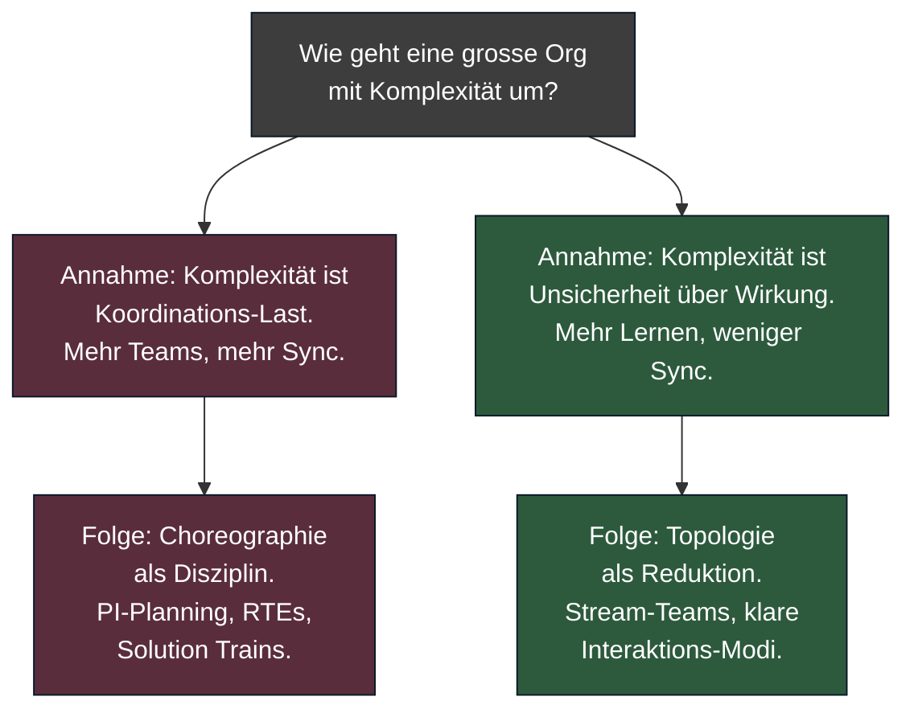
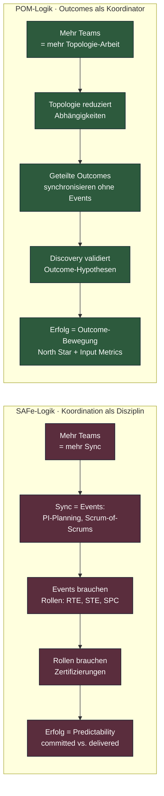

# SAFe vs. POM — Acht Probleme, zwei Antworten

SAFe und der [Product Operating Model](../methods/modern/product-operating-model.md)
beantworten dieselben Org-Fragen — aber sie tun das aus *grundverschiedenen
Annahmen über Komplexität* heraus. SAFe behandelt Skalierung als
Koordinations-Logistik. POM behandelt sie als Lern-Architektur.

Dieses Dokument stellt acht typische Enterprise-Probleme nebeneinander
und zeigt, wie beide Lager antworten. Es ist bewusst zugespitzt — in der
Praxis gibt es Mischformen. Aber wer die Mischform nicht aus einer
klaren These heraus baut, bekommt die Schwächen beider Welten.

---

## Diagramm 1: Die Grundannahme über Komplexität

Diese Wurzel-Differenz erklärt alle Detail-Unterschiede unten. SAFe
nimmt an, dass Probleme durch *mehr Information zwischen Teams* gelöst
werden. POM nimmt an, dass Probleme durch *weniger Abhängigkeit zwischen
Teams* gelöst werden.

---

## Acht Probleme im direkten Vergleich

| Problem | SAFe-Antwort | POM-Antwort |
|---|---|---|
| **1. Cross-Team-Koordination** | PI-Planning alle 8–12 Wochen, Solution Trains, ART-Sync-Meetings. Koordination ist Event. | Geteilte Outcomes als koordinierender Mechanismus. Sync entsteht aus gemeinsamem Ziel, nicht aus Kalender. Siehe [Team Topologies](../methods/modern/team-topologies.md). |
| **2. Dependency Management** | Dependency Board, Cross-Team-Dependencies werden im PI-Planning explizit gemacht und gemanagt. | Dependencies werden *eliminiert*, nicht gemanagt. Topologie-Schnitt entlang von Value-Streams. Platform-Teams stellen X-as-a-Service bereit. |
| **3. Customer Contact** | Lean UX als Spur im Framework, Customer Voice über Product Manager-Rolle gefiltert. | [Continuous Discovery](../methods/discovery/continuous-discovery.md): Product Trio (PM, Design, Tech-Lead) spricht wöchentlich direkt mit Kunden. Kein Filter. |
| **4. Priorisierung** | WSJF (Weighted Shortest Job First), Cost of Delay über Job-Size. Quantifiziert pro Feature. | [Outcome-Roadmapping](../methods/modern/outcome-roadmapping.md): Bets gegen Outcome-Hypothesen, validiert durch Evidence. Priorisiert wird der *Outcome*, nicht das Feature. |
| **5. Roadmap-Kommunikation an Leadership** | Portfolio-Kanban, Epic-Hypothesis-Statements, Lean Budgets. Roadmap als Lieferplan über mehrere PIs. | Roadmap als Bets-Liste mit Konfidenz-Level. "Now / Next / Later" statt fixer Quartalsdaten. Leadership versteht Unsicherheit als Feature. |
| **6. Skill-Aufbau / Career Paths** | SAFe-Zertifizierungen (SA, SPC, RTE), klare Rollen-Stufen, Trainings-Industrie. | Product Coaches: Senior-PMs coachen junge PMs. Engineering-Coaches analog. Karriere über *Wirkung*, nicht Rolle. Knapp an Senior-Talent. |
| **7. Compliance / Audit-Trails** | Built-in via Lean Portfolio Management, dokumentierte Approvals an Quality Gates. | Governance als Querschnitts-Layer im [Outcome-Loop](../cycle/enterprise-outcome-loop.md): Leitplanken auf Bet-Ebene, automatisierte Reviews bei Ship. Audit über Telemetrie, nicht über Approvals. |
| **8. Output- vs. Outcome-Messung** | Predictability-Measure (committed vs. achieved Features). PI-Objectives mit Business-Value-Score, oft Output verkleidet als Outcome. | North Star Metric + Input Metrics auf Strategie-Ebene, OKRs auf Portfolio-Ebene, Telemetrie auf Team-Ebene. Output (Ship) ist Mittel, nie Ziel. |

---

## Diagramm 2: Die Antwort-Logik nebeneinander

Beide Spalten sind in sich kohärent. Das ist wichtig: SAFe ist *nicht*
inkonsistent oder schlecht designed. Es ist konsistent mit *einer
bestimmten Theorie über Komplexität* — der Theorie, dass mehr Sync mehr
Wert schafft. Wer diese Theorie nicht teilt, wird auch keine SAFe-Praxis
gut finden.

---

## Wo SAFe verteidigt wird

Es gibt drei legitime Argumente für SAFe in der Enterprise-Praxis, die
hier nicht klein geredet werden sollen:

1. **Beginner-Friendliness:** SAFe gibt einer Org, die aus Wasserfall
   kommt, ein vorgefertigtes Vokabular und einen Trainings-Pfad. Das ist
   ein realer Wert in den ersten 18 Monaten.
2. **Audit-Tauglichkeit:** Regulierte Branchen (Banken, Pharma, Telco)
   bekommen mit SAFe ein dokumentierbares Vorgehen, das Wirtschaftsprüfer
   verstehen. Das spart Diskussionen.
3. **Politische Stabilität:** SAFe-Rollen (RTE, SPC) geben mittleren
   Managern eine neue Heimat. POM verlangt von ihnen, Macht abzugeben —
   politisch teurer.

Die Frage ist nicht *"Ist SAFe falsch?"*, sondern *"Bezahlt die Org
diese drei Vorteile mit dem Preis der Output-Steuerung — wissentlich?"*

---

## Schlusswort

Die Frameworks unterscheiden sich nicht in Detail-Praktiken. Beide
kennen Standups, Retros, Roadmaps, Backlogs. Sie unterscheiden sich in
der zugrundeliegenden **Theorie über Komplexität**: SAFe sagt, mehr
Koordination schafft mehr Klarheit; POM sagt, weniger Koordination und
mehr Lernen schafft mehr Klarheit.

Beide Thesen sind empirisch testbar — und werden in einzelnen Orgs
laufend getestet. Die Evidenz aus der [Vergleichsmatrix](../comparison/matrix.md)
und aus den profilierten Methoden spricht für POM, vor allem bei
Tech-getriebenen Orgs jenseits von 500 Personen. Aber die Wahl bleibt
eine Wahl. Wer sich entscheidet, sollte das *bewusst* und mit Verständnis
beider Logiken tun — nicht weil ein Beratungsangebot gerade verfügbar
war.

→ Wer sich für POM entscheidet, findet im
[Enterprise Outcome-Loop](../cycle/enterprise-outcome-loop.md) den
Bauplan. Wer den Übergang plant, sollte vorher das
[Maturity-Modell](maturity-modell.md) durchgehen.
